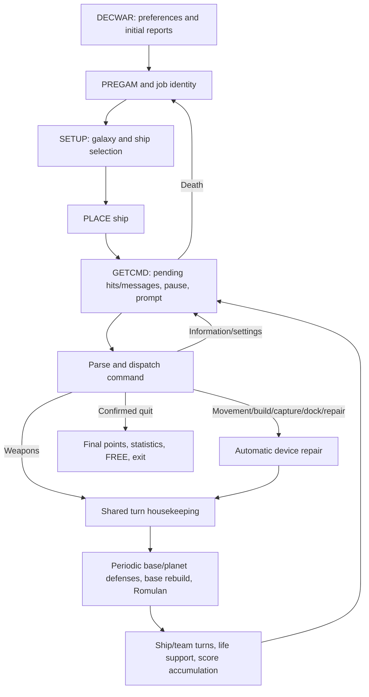

# Source study

This record began with the CompuServe archive and retains development
checkpoints. Unqualified source filenames and line numbers refer to that archive
unless an entry identifies Austin. Earlier integration gaps and proposed policies
describe their checkpoint, not the current release. See [current status](status.md),
[architecture](architecture.md), [playable repairs](playable-decisions.md) and the
[Austin implementation ledger](austin-implementation.md) for delivered behavior
and remaining limits. Numbered decisions and source evidence remain preserved.

This document records findings from the supplied files. It does not claim a
complete audit. Source references below are physical line numbers in the
unchanged archive; `source-index.md` links the files, and `source-manifest.json`
records their hashes. Executable statements take precedence over comments.

## What the archive actually contains

The folder's `1978` label is not a precise executable version. `changes` lists
later modifications; `DECWAR.FOR:31` assigns `VERSIO = 24`, whereas
`MSG.MAC:65` displays `[DECWAR Version 2.3, 20-Nov-81]`. Both must be retained.
Do not "correct" the displayed version to match the internal variable.

`DECCMP.CMD` names the compilation units; `CAN1.CMD` selects the executable's
link order and the external `SYS:FORLIB` library. The archive also has older
build commands, experiments, utilities, documentation sources, and generated
includes. `DECWAR.IMP` describes the earlier distribution organization. It does
not override the supplied build files.

In particular, `GETLIN.MAC` is a standalone input/editor program and is not in
the chosen build. The game uses the routines embedded in `WARMAC.MAC`.
`DEFINE.FOR`, `DW2.FOR`, `ALT.COD`, and `TORP.COD` must not automatically become
extra gameplay features just because they exist. Separately compiled helpers
and code incorporated into another compilation unit are different cases; for
example, inspect the hangup code inside WARMAC before relying on `CISHNG.MAC`.

## State and execution model

`HISEG.FOR` / `WARMAC.MAC:391-466` define shared galaxy state: ships, bases,
planets, board, Romulan, team totals, activity, queues' flags, and locks.
`LOWSEG.FOR` / `WARMAC.MAC:467-524` define session state: tokens, current ship,
output preferences, command pause, phaser/torpedo recharge times, and the
scratch fields used to build hits and messages. `LOCAL` is reused scratch
storage. Other COMMON declarations overlay or extend routine-specific storage.

The original is multiple monitor jobs sharing a writable high segment. A new
TCP connection must get a distinct low segment/session, while sharing the
appropriate galaxy. The random seed is low-segment state, not one global RNG
for the entire server. Moving it to a shared generator changes tournament
initialization and random draw sequences as players interact.

Tournament seeding uses `IABS(TKNLST(i))`, the packed first word of the token,
not its parsed numeric VALLST. Even a numeric tournament name must follow that
packing path (`SETUP.FOR:264`). The absolute value applies to the signed
36-bit word. This is another reason to retain ASCII word representation.

One-based, column-major arrays matter wherever memory is manipulated. For
`SHPCON(KNPLAY,10)`, consecutive ship indices occupy adjacent words. Ordinary
row-major JavaScript nested arrays are not interchangeable with BLKSET,
BLKMOV, LOCF, COMMON overlays, or assembly byte pointers.

`ALIVE` needs special care: `SETUP.FOR` initializes it to positive 1 for vacant
ships, then assigns `.TRUE.` to reserve a ship. Ship selection explicitly tests
positive/nonpositive values. It is not safe to collapse every nonzero integer
to one Boolean. The exact compiler treatment of logical expressions also needs
to be verified before porting all callers.

This is a map of the main paths, not a replacement specification. Alternate
returns and early exits alter which paths consume time. `DECWAR.FOR:254-288`
is the authoritative order for end-of-command work.

`GETCMD.FOR:38-83` drains pending queues and delays by PTIME, then polls input
with KCMDTM=2000 milliseconds. Idle polling also delivers asynchronous hits
and messages. `DOTIME` is shared and gates defenses relative to NUMPLY. A
universal real-time tick, or incrementing the stardate on every command, would
change the game.

## Integer tricks and the arithmetic contract

`PARAM.FOR` says `IMPLICIT INTEGER (A-Z)`: even names that modern FORTRAN users
might assume are real are integer unless explicitly declared otherwise. `RAN`
and `PWR` are explicitly real; routines introduce more REAL declarations.

The extra zeros usually implement **fixed-point scaling**, not a wider integer
type. They retain fractional game units in an integer word. Integer division
still discards remainders, so algebraic rearrangement can change results.

| Quantity | Stored value | Visible interpretation | Evidence |
|---|---:|---|---|
| Ship energy at creation | 50000 | 5000.0 units through OFLT | SETUP final assignments; WARMAC OFLT |
| Full shield strength | 1000 | 100.0 percent | SETUP; SHIELD; OFLT |
| Critical device damage | 3000 | 300.0 damage units | PARAM KCRIT |
| Fatal ship damage | 25000 | 2500.0 damage units | PARAM KENDAM |
| Regular automatic device repair | 300 | 30.0 damage units | REPAIR |
| Default requested repair underway | 500 | 50.0 damage units | REPAIR |
| Default requested repair docked | 1000 | 100.0 damage units | REPAIR |
| Shield raising charge | 1000 | 100.0 energy units | SHIELD |
| Warp energy charge before multipliers | `40*distance*distance` | `4*distance²` energy units | MOVE |

Not every quantity is in tenths: coordinates, torpedoes, turns, build counts,
bit masks, and millisecond times have their own meanings. Do not divide all
numeric values by ten at an API boundary.

For SHIELD TRANSFER 1, the source multiplies the input by ten, subtracts ten
internal energy units, and adds `10/25`, truncated to zero, to shield strength.
The lost remainder is observable behavior. A conservation-of-energy rewrite
would change it. Similarly, SHIELD TRANSFER can transfer energy back, subject
to both reserve limits. It confirms before transferring all remaining ship
energy.

Word primitives use BigInt because JavaScript bitwise operators operate at
32 bits and general products of 36-bit operands exceed Number's exact integer
range. Low-word arithmetic is separate from compiler overflow/trap policy,
which is not established by these primitives.

ENERGY illustrates a mixed arithmetic path despite integer energy storage.
It multiplies the requested units by ten, evaluates `INT(IHITA*0.9)`, caps the
result to receiver capacity, then charges `IHITA + IHITA/9` to the donor.
The floating result and integer truncation both matter; a single ten-percent
loss rule is insufficient. The command and notification path are now ported
with a required service for that original floating expression. Its validation
also rejects spending exactly all donor energy, even when receiver capacity
would have reduced the final amount (`ENERGY.FOR:82-104`).

MACRO defaults to octal in relevant assembly regions; FORTRAN ordinary integer
literals are decimal and its leading double quote denotes octal. `^D` in MACRO
forces decimal. `MOVEI` produces an 18-bit effective address; this matters even
when comments describe a general integer. The five-character ASCII packing is
five 7-bit bytes with one spare bit, while SIXBIT packs six characters per word.

## Space, geometry, and movement

The board is 75 by 75. Each 36-bit word contains three 12-bit cells, for 1875
words. DISP maps 12 ones to -1; other values encode `objectClass*100+index`.
Classes 1/2 are team ships, 3/4 bases, 5 Romulan, 6/7/8 planets, 9 stars,
10 black holes. `DISPC` divides by 100; `DISPX` obtains the remainder using
MOVEI. The latter returns an 18-bit masked value for negative remainders.

`PDIST` is max(|vertical difference|, |horizontal difference|).
`LDIS` separately compares each axis to a limit. Diagonal adjacency counts.
`DIST.FOR` separately uses squared Euclidean distances when selecting Romulan
targets, then returns PDIST for the chosen target. These metrics must not be
unified.

`MOVE.FOR` contains the IMPULS entry. Impulse permits one sector; ordinary warp
can attempt up to six; warp five/six can overheat. Partial warp damage restricts
movement above three. Energy uses the requested distance after path checking,
with shield and tractor multipliers. Preserve that ordering when collisions
shorten the path.

`CHECK.FOR` and `CHKPNT.FOR` are not standard grid ray tracing. They test two
neighboring cells near a boundary and may consume a random draw to choose the
final coordinate. CHKPNT's actual condition is
`ABS(MOD(INT(c*100),100)-50) < 10`, not the inclusive prose threshold in its
comment. Formal H/V names also differ from caller COMMON names; preserve
argument positions rather than renaming from a superficial coordinate guess.

LOCATE/RELOC, CHECK/CHKPNT and MOVE/IMPULS are now ported and composed. LOCATE
rewrites only selected token fields: numeric coordinates leave text, types,
pointers and NTOK intact; COMPUTED shifts text/type/value without pointers,
changes NTOK before validation, and expands names backwards without adding an
EOL. An odd leading scalar bypasses translation and range checking. A zero
coordinate count returns before even a positive exact-count requirement.

CHECK tests the dominant step, then one or two fractional candidates. Only
positive DISP blocks travel; a negative sentinel is clear. A successful pair
consumes RAN; a collision rereads DISP for DCODE. Galaxy exits restore the last
clear position with DCODE zero. All mixed-real expressions retain explicit
conversion boundaries through required arithmetic services.

MOVE draws IRAN(4000) before coordinate input and sets GREEN/undocked before
speed validation. Its overheating report uses tenths and RANDAM/30 integer
truncation. Requested-distance energy is charged before destination/source
locks; lock failure preserves that charge. CHECK is not repeated after a lock
wait. Towing runs after both unlocks, writes the destination before clearing the
old cell, and uses V1-INT(DISV) for the board versus INT(FLOAT(V1)-DISV) for the
stored ship coordinate. Fractional displacements can therefore make those
positions disagree. These source behaviors are retained, with focused tests.
The exact-rational test service does not establish PDP-10 floating equivalence.

## Combat and world behavior examined so far

PHACON is now ported as a complete driver, with actual planet and Romulan hit
paths. It chooses the earlier PHBANK (ties favor bank one), validates target
class/allegiance/range before waiting, then validates optional shot strength
after the wait. Shield condition zero incurs the cycling charge. Overheating
uses a strict integer product threshold and another draw for mixed-real damage.
The final energy cost and bank-ready timestamp follow all hit notifications;
PTIME is not assigned. Ship/base damage now composes the ported PHADAM body.

PRIDIS now selects recipient bits using numeric ALIVE<=0, physical roster
halves and inclusive LDIS. PHACON planet shots leave IHITA, SHCNTO, critical and
kill fields unchanged until MAKHIT clears them. Base announcements apply NOMSG,
whereas the direct hit unions target-team range, nearby observers and the
sender's bit. Tests compose these paths with the actual packed hit queue and
OUTHIT, including source output bytes.

PHAROM, TOROM and DEADRO from ROMDRV are ported separately from its
movement/attack driver. PHAROM divides to IHITA, then divides IHITA by ten to
reduce EROM; TOROM caps IRAN(4000) at 2000. Death clears ROM and the board while
retaining LOCR and potentially negative EROM. PHACON adds IHITA plus a 5000
bonus when the resulting ROM word tests false.

JUMP and BASKIL are now ported prerequisites for shared damage. JUMP uses
integer assignment after real displacement addition, requires exactly one
sector, and tests DISPC, so a negative DISP sentinel counts as empty. Its normal
Romulan board code includes J. Black-hole death keeps stored old coordinates,
leaves the hole present, and does not perform broader lifecycle cleanup.
BASKIL preserves the source NUMCAP<=0 jump to the next ship; without captured
planets, even loss of the last nearby base can leave docking unchanged.

TORDAM/PHADAM is now ported with persistent shared real locals and explicit
compiler/numeric services. The torpedo entry's already-destroyed checks are
bypassed by PHADAM. Torpedo deflection still reaches JUMP for surviving ships.
Hull damage, remaining energy and score additions each assign mixed-real
expressions independently, so integer damage gained and energy lost can differ
by one. Phaser shield condition zero absorbs damage without halving POWFAC.
Overfull shields can produce negative damage; no new cap is inserted.

Critical ship hits halve HITA for device damage, then add a separate random
hull variation. The earlier IRAN(5) appears inside a compound expression; the
compiler evaluation service controls whether it is reached. Critical base
jumps can skip ordinary damage subtraction and scoring. Base death calls BASKIL
before decrementing NBASE and clearing strength/board. A base critically killed
while still positive can therefore preserve nearby docking. Stale KLFLG/critical
registers are retained wherever source assignments omit them.

PWR now follows WARMAC's multiplication tree: powers below five multiply
left-to-right, larger powers recurse into the half exponent, square and multiply
once more if odd. Negative exponents produce the loaded 1.0 rather than a
reciprocal. Each FMPR result remains opaque through a required machine service;
there is no Math.pow replacement. Exact-rational test fixtures establish
source control flow, not PDP-10 rounding or floating execution equivalence.

SNOVA, NOVA and PLNRMV are now ported as TORP's star/planet dependencies.
SNOVA stores victims and stars in the original column-major arrays, scans rows
then columns, and pops victims before stars in reverse discovery order. It
rereads DISP for each popped victim, so earlier damage or planet compaction can
change the identity eventually passed to NOVA. Accepted neighboring stars are
cleared immediately. The pending-star limit is 29 despite STRSTK having 80 rows;
its IRAN exclusion happens before capacity checking. Only chained stars are
charged here; TORP handles the initially hit star's penalty.

NOVA has its own device, energy and shield formulas and sends hit notifications
itself. Ship-kill scores go directly to TMSCOR, while other damage uses TPOINT or
RSR. For full-strength bases, distress MAKHIT clears IHITA before the subsequent
nova-hit report. Base destruction decrements NBASE before BASKIL, unlike shared
weapon damage. Surviving Romulans jump and then halve EROM; black-hole death can
prevent that halving. The commented-out random Romulan kill is not restored.

NOVA subtracts three planet build units under PLNLOK and sends MAKHIT before
checking the live build value again. Negative builds trigger removal; exactly
zero survives. PLNRMV decrements captured counts and calls BASKIL before shifting
four planet columns. It retains the old final row and subtracts one from the
existing display codes at shifted positions, without regenerating classes or
clearing the removed cell. ENDGAM may not return; no synthetic unlock is added
when it exits inside NOVA's removal path.

TORP's driver is now ported (`TORP.FOR:24-264`). It clears all seven words of
TORPL(3,2)/TPAUS after the critical-tube gate, reuses the last supplied target
pair and validates the whole burst before waiting. An initial positive LOCATE
result skips the prompted odd-count test; incomplete inline pairs can therefore
read stale VALLST words. Separately prompted target input accepts an even zero
result. These paths are preserved instead of imposing a new argument grammar.

Firing sets RED after the bank wait, draws normal/device/shield deflection,
then checks whether the target is now the ship's own position. Docked firing
keeps ammunition, but entry still requires it. A misfire spends a torpedo and
still resolves that shot, with extra deflection and possible tube damage;
the next loop iteration stops after setting source hit fields. The range
expression retains signed INT truncation, and recharge accumulates milliseconds
using current SLWEST and tube damage. Normal
returns set TOBANK but never PTIME; early alternate returns leave TOBANK alone.

Every nonempty CHECK collision consumes IRAN(100), even when that draw will not
affect the target branch. Star instability is above 80; a nova at or below 80
charges the initial star separately before SNOVA. Real TORDAM/TOROM, JUMP,
TRCOFF, SNOVA/NOVA and PLNRMV are exercised through the driver. The next shot
traces the current board, including earlier displacement or destruction.

Planet locking failure retains the fired ammunition and TPAUS but returns
alternately with the source's misleading empty-tubes literal. A successful hit
removes a planet only after negative builds set KLFLG, or when a stale nonzero
KLFLG already exists. Removal precedes unlock and the hit message; ENDGAM can
stop that path permanently. Ordinary damage reports precede tractor release
and base-destruction announcements. MAKHIT's register clearing is preserved,
including the cleared sender in the later base-destruction notice. Tests compose
full bursts through packed queues and OUTHIT; their byte expectations remain
source-derived, not captured historical transcripts.

Phasers (`PHACON`) select the earlier-ready of two banks, accept an optional
50..500 setting (default 200), use different eligibility checks, and apply a
shield-control energy charge. Damage is shared through `TORDAM`'s PHADAM entry.
The common damage paths update hit metadata, shields, ship energy, devices,
scores, displacement, deaths, and bases. A single generic "damage amount"
function would omit important side effects.

BASPHA, PLNATK and BASBLD are now ported and composed through finishTurn.
BASPHA scans the opposing base team for PLAYER calls, or both teams for a
Romulan call. It checks NBASE once on entering a team and strength once on
entering a base, then scans the opposing physical ship half before the Romulan.
Ship tests require logical ALIVE, positive DISP and distance at most four.
PHADAM receives 200/NUMPLY after integer truncation and .FALSE. for firing-ship
status, leaving the driver to credit the base owner's TMSCOR. Sender strength
is read after damage. Two PRIDIS calls replace then extend the mask, followed
by a forced victim bit; the first uses the current session TEAM. Romulan fire
uses the same divided power but one unfiltered PRIDIS after PHAROM.

PLNATK captures NPLNET's loop bound while reading each row live. Each planet's
PCODE/PTEAM are retained across its attacks. Neutral IRAN(2) exclusion comes
before PLAYER's friendly-planet exclusion; compiler eager AND can consume this
draw even for captured planets. Both ship halves are scanned, excluding the
planet's own side, dead/cloaked targets and distance above two. It passes the
literal class 2 to PHADAM even for Federation targets. Ship power is
(50+30*builds)/NUMPLY; Romulan power is 50+30*builds with no population divisor.
Only captured planets credit TMSCOR. Unlike BASPHA, it does not force a victim
bit or assign SHCNFR, and it selects Romulan recipients before PHAROM.

Both drivers preserve MAKHIT's register clearing, current coordinates on later
recipient calls, and ALIVE rechecks for subsequent attackers. Neither releases
tractors after defensive kills. Negative planet builds are not clamped: under
the supplied expressions they can yield negative PHADAM damage, repairing hull
and adding energy. This is a retained source consequence, not a new game rule.

BASBLD computes 50/(NUMPLY+1) even when PLAYER subsequently replaces it with
25/NUMSID(TEAM). Player calls repair the opposing side; Romulan calls repair
both. It ignores NBASE counts, scans every slot, skips nonpositive strength and
applies MIN0(strength+increment,1000). Population division truncates before
addition; no minimum increment or lower bound is added. Division exceptions
remain internal unresolved monitor/compiler behavior, not new terminal errors.

BUILD and CAPTUR are now ported with actual LOCATE, BASKIL, PLNRMV, PHADAM and
output/dispatch compositions. Both establish deadlines before input and set
PTIME to deadline minus the final clock, permitting negative time after long
input or notification waits. Alternate returns leave PTIME unchanged.

BUILD adds one and awards 500 times the resulting build count. The fifth build
goes straight to scoring and locking without printing a build count. Its early
capacity check requires exactly four builds and exactly KNBASE bases; it is not
an at-least test. Lock failure leaves five builds and the 2500 points in place.
A later BUILD then advances to six without retrying conversion. If no empty
base slot exists after locking, it subtracts one build but keeps those points.
Successful conversion awards another 2500, increments NBASE and copies the
planet's LIST knowledge before PLNRMV. Only after removal and unlock does it
fill the base coordinates/strength and board code. The original five-command
sequence awards 10000 points. ENDGAM sees the incremented base count even though
that slot has not been initialized; it can return or prevent completion.

CAPTUR invokes BASKIL while old ownership, captured count and board code remain
unchanged, so a ship may retain docking supported by the very planet being
captured. It then transfers counts, computes undivided defensive PHIT, adds one
second and charges 500 stored energy units per build, clears builds and unlocks.
Ownership changes on the board before PHADAM attacks the capturing ship.
The old planet owner receives defensive damage/kill scores; the capturing
player receives 1000 capture points after MAKHIT, even if killed. PTIME is set
before the final energy/hull death test and its team-specific output. Neither
failure nor death rolls back ownership, and no tractor release is inserted.

The initial CAPTUR recipient calculations preserve a neutral planet's stale
DBITS because its first range call is skipped, while the later team PRIDIS
replaces that mask before MAKHIT. PHADAM gets writable TEAM/WHO/ID/PHIT, and
PLNRMV gets BUILD's actual I/TEAM references. Later reads follow changed values.
Tests compose final output with packed hit delivery and automatic REPAIR after
critical defense; they remain source-derived rather than historical transcripts.

DIST, ROMSTR and ROMTOR are now ported as ROMDRV prerequisites. DIST clears
only the four Z words of its sixteen-word DISTLC storage. It tests ALIVE for
Federation ships but a nonzero vertical position for Klingon ships, accepting
positive display cells for both. Bases require positive count/strength but
only a nonzero display, including a negative sentinel. Squared distance picks
within-class candidates with strict improvements; cross-class ties use separate
compiler-controlled IRAN(2) calls. The final NUM uses PDIST, not the squared
metric. Initial Z=KGALV*KGALH+1 can reject real far-away candidates. When none
qualify, it still selects a class and returns stale IV/V/H storage.

ROMSTR scans the clipped three-by-three neighborhood in row/column order and
uses the first star, including the center. It writes the supplied V then H
references. ROMTOR calls it after every retarget, even after the third shot.
A miss instead advances directly without retargeting or an output message.
The next iteration draws deflection before testing an earlier misfire, unlike
TORP. Both misfired shots still resolve; ROMTOR does not model player ammunition
or tube damage.

ROMTOR composes actual TORDAM but overwrites IWHAT with 2 after it returns,
including a deflection reported internally as type 3. Source metadata is filled
after damage; base distress and later destruction remain separate queue writes.
Planet damage reuses the collision ARAN with >=75 rather than a fresh IRAN(4).
Planet-lock failure skips both reporting and retargeting. Stale KLFLG can remove
a positive-build planet. A nova that kills the Romulan returns immediately,
bypassing the normal RTPAUS assignment; initial and chained star penalties use
their separate RSR writes.

ROMDRV passes its V1/H1 CHECK output words directly as ROMTOR's direction
arguments. ROMTOR forwards them unchanged to CHECK, whose first assignments
overwrite those same words before it uses the direction. The composed test
keeps this alias; copying relative coordinates would change the source path.
ROMDRV now preserves these addresses through its actual ROMTOR call. Its full
main entry is ported, including creation, movement, weapon deadlines, phasers,
speech and the following base/planet defense cycle (ROMDRV.FOR:32-208).

The throttle precedes PLAYER and turn changes. Later creation/recharge waits
can count a Romulan turn without an attack. Creation writes board code 501,
EROM=IRAN(200)+200 and NUMROM, but leaves both weapon deadlines unchanged;
movement later writes 500. Collision escape searches negative vertical then
negative horizontal offsets at each step, without a symmetric search.

Weapon availability uses strict comparisons: equality can fall through to
torpedoes even when their bank deadline is later. Phaser damage uses fixed
power 200 and assigns the caller's ID, leaving PHIT alone. Recharge occurs
after the hit queue returns and samples the current terminal speed. The driver
then calls speech and all three defense routines, even after ROMTOR kills the
Romulan. Tests compose this with finishTurn's preceding defense cycle. PLAYER
remains false until DECWAR's command-loop reset. Column-D profiling calls are
explicit required services: their compilation mode and monitor timing are not
assumed.

`DOCK` accumulates contributions from every adjacent friendly base (two) and
planet (one), rather than choosing one docking target. Repeated docking doubles
the hull repair contribution for an already docked ship. It replenishes
resources independently and resets life support to five turns.

`ENDGAM` first requires no planets and at least one side without bases. Its
total-destruction case does not bypass the later individual victory-message
tests. Replacing it with an exclusive winner/loser branch could alter output.

These paths now have source-derived ports and tested compositions as recorded
in status.md. This does not establish complete integration, exhaustive memory
interleavings or historical runtime behavior.

## Assembly is application code too

WARMAC includes the parser, formatting, random numbers, scans, shared queues,
hit/message serialization, user identity, HELP/NEWS/GRIPE, statistics, locking,
hangup and interrupt handling, startup and shutdown. It cannot be replaced by
a few convenient platform wrappers.

MSG.MAC exists partly to avoid FORTRAN literal padding and to keep strings in
the high segment (`DECWAR.IMP`). Extracting its ASCIZ bytes preserves spelling,
spaces, and embedded CR/LF. It does not yet cover every inline FORTRAN literal,
assembly inline string, BYTE directive, help-file paging rule, or output
function. A complete terminal transcript requires all of those layers.

The statistics subsystem illustrates why comments and modern data structures
are insufficient as specifications. UPDSTA's “score too small” check actually
reads elapsed time; equal-score ranking favors the longer elapsed time. Its
ten-word insertion leaves an old word in place and retains duplicate PPNs below
the new placement. UPDCAP maintains a game serial and per-ship commission
counts, with different read/write sequences for free players. These algorithms
are now ported against the original 640-word buffer, with monitor I/O left as
required operations. Their direct OUTSTR messages do not update the buffered
formatter's cursor state. SHOSTA is now ported with its separate buffered OSTR
path, physical record traversal and inconsistent header/row width tests.
STAZAP's port retains its logging boundary and partial buffer clear. GRIPE is
now ported and composed with STAZAP/SHOSTA; the persistence adapter and pre-game
integration remain unfinished.

TRACTR and its shared TRCOFF entry are now ported together. The command can
switch off an existing beam with no destination, but doing so writes through
IP even though DECWAR supplies no argument. The port exposes that compiler
address contract. It preserves first-prefix name matching, team-before-ALIVE
validation, diagonal adjacency, target-beam-before-shields ordering, and the
absence of device-damage and energy tests.

Both beam links are written before the hit notification is queued. Only DBITS
and IWHAT are set; the other hit fields retain their earlier words until MAKHIT.
TRCOFF rereads its IP reference between clear operations, so an aliased argument
can redirect the second write. Explicit memory tests cover TRSTAT(0)/NUMROM and
BITS(0)/NAMES. Compositions use the real queues, OUTHIT, GETCMD, SHIELD and FREE.
MOVE now ports the towing assignments; complete compiler/session bindings and
remaining combat callers remain open.

DECWAR's application entry is now ported and composed with the prior drivers.
It clears LFZ:LLZ, sets VERSIO=24, emits the original 2.3 banner, and asks one
experience question. Invalid answers do not repeat; numeric values and text
prefixes both participate regardless of token type. TYPE(1), TYPE(2) and SUMMAR
run before the first PREGAM. Later death returns directly to PREGAM, then SETUP,
APRSET and ship PLACE. Composed tests exercise first-player creation, TIME,
QUIT/FREE, and GETCMD death followed by recommissioning.

The five fatal branches in DECWAR are also ported, retaining their distinct
text, one IRAN(5) draw and shared exit path. They are separate from the FMSGS
table in WARMAC. A monitor transfer signal enters them; real APR register/stack
capture and GRIPE-before-transfer remain unfinished. FRCCHK is only a JSQTIM
clear because CHKSEQ immediately returns. KILCHK is defined but has no caller
in the supplied executable source, so the entry driver does not introduce one.

POINTS has an additional compiler dependency: its final-report entry jumps
into an uninitialized DO loop. The source does not establish what loop-control
state the compiled executable uses on that path. This is recorded separately
from the integer score totals and their tenths formatting; it is not silently
rewritten as an ordinary “ALL” command. Its ordinary in-game parser and report
are now ported, including all eight categories, selected columns and integer
division before tenths formatting. Tests compose the same score words written
by turn accounting with the dispatcher and POINTS. The final-entry adapter and
pre-game SCORE(i,0) access remain distinct unresolved contracts.

The next required evidence is a numeric/monitor contract for the instructions
and runtime services the archive invokes but does not define. Until that is
resolved, there is no valid claim of bit-exact floating arithmetic or exact
monitor/Telnet behavior.

USERS and STAT are now ported: output always includes all six identity fields,
the separator is emitted even when the second team is empty, and fields read
the shared JOB words during formatting. STAT.Y retains its internal register
entry contract. The LIST selection helper LSTUPD is also ported; its unseen
whole-game summary path bypasses range and closest checks, and aliased dummy
arguments make assignment order observable. LIST's five-entry driver and
LSTSCN parser are now ported, with source defaults, keyword ordering and exact
group-error output. LSTSCN also exposes two compiler/memory questions: its
unassigned SHIP local differs from SHIPS, and its coordinate lookahead can
cross the token-array boundary. LSTFLG traversal and LSTOBJ/LSTOUT/LSTSUM now
compose with those routines across all five dispatch slots. Their report
effects include count clearing, scan-knowledge writes, and retained output
after a later group error. Literal bytes, raw logical tests, implicit locals
and reversed DO bounds remain explicit runtime contracts. See compatibility.md
for source locations and evidence limits.

SCAN/SRSCAN and their assembly screen routines are now ported. The code makes
an important distinction between the rectangle drawn for the captain and the
sensor-radius loop that records known planets and bases. Its packed buffer
also carries stale bytes outside newly terminated rows, and its object table
differs from LIST's formatter. Tests compose the source warning overlay,
descending screen output, row-boundary Ctrl-C and later LIST visibility. This
does not yet establish monitor behavior or bind all uses of shared LOCAL to
one session memory image.

TELL is now ported with its input, recipient filtering and immediate Romulan
interaction branches. Radio enabling occurs before destination input, invalid
names do not abort later recipients, and a Romulan reply can precede repeat
rejection of the next token. Its relocation search shares one random starting
offset for both nested coordinate loops. Human message tests compose the real
queue and OUTMSG. ROMSPK now has its own port and composed tests using its
75 extracted phrase/node strings, raw GETLIN result and source random draw
schedule. Its 18-bit/9-bit population masks differ from the current ten-player
layout: excess message-counter writes alias HITFLG, and excess recipient bits
can keep queue entries linked after all players read them. Its sender code 500
reaches OUTMSG's BITS(0), aliasing the last NAMES word. Component memory views
now preserve these accesses; the actual compiled DATA word and live monitor
bindings remain required. Node-prefix comments also differ from the actual
ANDI instructions, which retain too few bits to match the advertised prefixes.

GRIPE illustrates why the modern port retains word-level file operations. It
collects a header and text into dynamic packed core storage, then reads the old
log after the last new word and writes the combined buffer from disk block one.
Its buffer-growth routine clears the next twenty words but leaves the current
word intact. Its output switches share cursor bookkeeping. While input is
pending, ESHP replaces the ship with object code 1000; PSHP later restores a
currently alive ship at its current coordinates. These routines, the twenty-line
driver, OSTS and the crash dump are ported with focused and composed tests.
Actual monitor input, core allocation, file-stack behavior and crash memory
remain explicit services. The supplied code provides no basis for silently
turning this subsystem into a conventional modern logging API.

HELP and NEWS now operate through source-derived byte readers. HELP resolves
command names before extra topics, then searches the help file using the
canonical entry's first five characters. It recognizes headings after LF/FF,
not at byte zero; its lookahead can consume a short heading's newline and skip
the first body line. NEWS instead treats a dot after LF/VT/FF as a continuation
prompt and consumes only that dot. It has no HELP-style RED-alert gate or board
removal. SLST and OLST preserve ambiguity output, blank entries and seven-column
rows. Archive-backed tests cover all 38 public help topics and the complete
news file without changing their bytes. Monitor I/O and full pre-game/session
bindings remain unfinished.

PREGAM and XGTCMD are now ported with their distinct initial and command-loop
prompts. Initial HELP prints both topic lists, HONORROLL invokes SHOSTA, and
blank NTOK returns to the main driver. The command loop instead tests the token
type and scans all sixteen entries, including private commands. Compositions
exercise actual input tails, HELP lists, SHOSTA, TIME and password handling.
JOBSTA uses references to the same first six LOCAL words as SETUP/KILCHK.
Complete pre-game command and session binding is still pending.

KILCHK and the two creation-cancellation entries are also ported. KILCHK's
repeated clock reads and reused TIMLFT local make its first timeout use seconds
as milliseconds. The archive sets KWAIT to zero, so ordinary past deaths skip
the countdown; future timestamps still expose the source path. Its BACKUP
contains a bell after a NUL, which OUT never reaches. CC1/CC2 decrement shared
counts before unlock/exit. None of these ports supplies the missing compiler,
monitor or complete session implementation.

SETUP's driver and PLACE are now ported. First-player setup zeros the specified
HISEG region, initializes queue links, asks the original options, and inserts
alternating Federation/Empire bases, sixty planets, stars and optional holes.
The two floating expressions remain required services. PLACE uses real integer
draws and retains retries, argument aliases, stale base positions and its raw
DISPC-versus-team comparison for planet exclusion.

Returning captains are matched through the killed queue, can keep an available
ship, and can be asked to defect or choose another ship. New captains use the
source team-balancing and first-prefix ship selection. SETUP releases FRELOK
before commissioning and reserving the selected slot; composed tests preserve
the resulting two-session race. Its terminal-speed loop checks ALIVE(WHO) while
reading JOB(I,KTTYSP), so vacant rows can affect SLWEST. The port retains that
index, the seven literal group masks and the selected-score reset. Complete
HFZ:HLZ memory, compiler contracts, monitor services and DECWAR startup/session
integration remain unfinished.

## DEBUG and performance timers

WARMAC.MAC:4274-4348 contains TIMIN, TIMOUT, TIMSRC and DEBUG. The named
TIMERS COMMON has four fifty-word arrays; HIGH.FOR:24 reserves 250 words,
confirmed by DECWAR.MAP:31. The final fifty words have no timer-array symbol.
TIMSTA and TIMLCN are separate fifty-word local arrays preceding STABUF
(WARMAC.MAC:674-676). Initial contents and complete memory binding remain
runtime responsibilities; the port requires caller-supplied words.

TIMSRC scans from index 49 downwards, stopping at equality or the first zero.
It compares the whole first argument word, including the unused ASCII bit.
At exhaustion it overwrites index zero with the ASCIZ word ?????, without
checking that slot for a match. Allocation resets only TIMHI, retaining counts
and totals. TIMOUT calls this same allocating search before checking TIMLCN,
so an unmatched stop request can still change the table. Nested starts with
the same name overwrite the earlier start; stops do not clear the local name.

TIMOUT increments its count before reading UCT. Failure of CALLI -210 supplies
zero, allowing a negative interval. The arithmetic wraps in source word order;
TIMHI compares the signed interval. The report multiplies totals/highs by 86400,
then extracts the unsigned left half of the low product word. It does not use
the normal game's elapsed-time formatter.

DEBUG requires a negative PASFLG. Rejection uses OSTR for the two ordinary
error strings with no trailing newline. Success uses direct OUTSTR/OUTCHR,
leaving the normal output cursor counters unchanged. Only DEBDEC's digits
check HUNGUP; names, tabs, header and line endings remain unguarded. DEBDEC
and DEBOCT store signed remainders in return-word left halves and zero-extend
those halves before adding ASCII zero; negative input is not sign-formatted
(WARMAC.MAC:4567-4582).

The report stops at a zero name without checking its index. When all fifty
slots are nonzero, it reads TIMNAM(-1) and lower addresses; other columns alias
the preceding arrays. The supplied map places TIMERS immediately after HISEG,
so even the first out-of-table read can be meaningful. The port requests the
surrounding memory instead of inserting a row-count guard. Instruction-level
interleavings, runtime traps, full register/stack aliasing, column-D compilation
and literal/monitor services remain unverified.

## Binding source COMMON words

The HISEG and LOWSEG includes now produce a checked field layout. Extraction
preserves declaration order, ranks, lower bounds, column-major dimensions and
source positions; a separate read of WARMAC's interface macros and dimension
constants must agree. DECWAR.MAP:22,31 supplies the linked bases and lengths:
LOWSEG is 128 words at octal 140; HISEG is 2922 words at octal 400010. These
are evidence for the supplied map, not a claim that every historical build
used those addresses. The memory binding accepts relocated bases explicitly.

Two naming differences occupy the same storage: FORTRAN INFLAG is assembly
INWAIT, and HILST is HI.LST. HILST inherits INTEGER from PARAM.FOR:21's
`IMPLICIT INTEGER (A-Z)`, agreeing with assembly INTEGER. The original
extraction incorrectly applied the language's default implicit type without
following PARAM; D-042 corrects this metadata. The binding accesses raw words.

All shared gameplay data views read and write source words. Player index zero
can alias the preceding SHPCON column (or HFZ); SHPDAM(:,0) aliases the last
SHPCON column; TRSTAT(0) aliases NUMROM; NUMSHP(0) aliases TMTURN(3). BITS(0)
is the final NAMES word. LOWSEG's GROUP(0,1) aliases SHJUMP, TPOINT(0) aliases
PLAYER, and token-array overruns reach the next array. These cases follow
column arithmetic rather than a separate list of special-case repairs.

Packed BOARD, PlayerSlot descriptive properties, score methods and KILQUE
search now have live memory bindings. The low-memory view covers all scalar
words, raw token arrays, hit fields, groups, TPOINT, PHBANK and terminal
HCPOS/BLANK. The queue and named local COMMON bindings are described below.
Token text/pointer conversion, unnamed compiler locals, stack/register memory
and full monitor address spaces remain pending.
No view initializes ships, compiled literals or uninitialized loader words.

The original clear spans are inclusive: DECWAR.FOR:30 clears LFZ through LLZ
(123 words), leaving INFLAG/HUNGUP/ADDRCK/LKFAIL/TERWID; SETUP.FOR:241 clears
HFZ through HLZ (2641 words), leaving locks, text tables, NUMPLY, SCORE and
HILST. Tests exercise these raw spans as well as live gameplay compositions.
The address-space layer wraps effective addresses to eighteen bits and values
to signed thirty-six-bit words; it delegates or rejects unmapped reads, rather
than inventing zero-filled memory or terminal-visible trap behavior.

## Loading the selected FORTRAN DATA

DECCMP.CMD selects BLKDAT and SETUP. Their twelve DATA statements initialize
219 words: 187 in HISEG and 32 in private PRECMD. The extractor expands target
indices in statement order and places them using the checked column-major
layout. It records literal spelling, source location and destination type.
Fifty values are integers; 169 quoted/Hollerith values require an explicit
compiler encoder, including padding. All selected DATA destinations are INTEGER,
explicitly declared or inherited through PARAM's implicit rule.

BLKDAT.FOR:26,29,64,74,84 initializes DEVICE, ISAYDO, XHELP, TTYDAT and NAMES.
NAMES iterates the second index inside the first, unlike the command tables;
its first three writes land at HISEG offsets 2751, 2761 and 2771. Two-character
ship suffixes remain two-character source literals until compilation. XHELP
contains an intentionally blank second row. BLKDAT.FOR:96 initializes only
BITS(1:10); BITS(11:18) retain supplied memory. DW2.FOR initializes more entries
but is outside the selected build. SBITS and CMDBTS follow at lines 99 and 101.

SETUP.FOR:215-217 initializes NUMPLY, NUMSID and TIM0. These are load-time
initializations, not assignments executed on each SETUP call. TIM0=-1 selects
the first-galaxy branch at lines 238-241, whose HFZ:HLZ clear removes that value
before the routine writes the clock. Loading DATA again on a join would reset
shared state. Private PRECMD is declared at line 504 and initialized at 505;
its sixteen entries follow FORTRAN KNPCMD and its destination inherits INTEGER
from PARAM.FOR:21, included by XGTCMD at SETUP.FOR:498. The earlier implicit-REAL
metadata was incorrect and is corrected in D-042. The independent WARMAC
KNPCMD value does not size this FORTRAN array.

Command, HELP, terminal and device readers can now access these live words.
GETCMD.FOR:92-98 stops scanning at the second match. TYPE.FOR:88-90 emits its
label before reading TTYDAT through OUT2W; WARMAC.MAC:2093-2101 copies both
words and a terminator before OSTR. Tests preserve that read order and the
index-zero alias into XHELP. Production compilation, automatic loader/session
wiring and other uninitialized words remain explicit unresolved services.

## Shared hit and message storage

WARMAC.MAC:754-766 begins the module's high segment with JSQTIM, JSQTAB,
HITSER, an anonymous hit header, HITQL, HITQ, an anonymous message header,
MSGQL and MSGQ. These occupy 2590 words. The extractor observes RADIX 10 for
the queue constants at lines 242-246 and RADIX 8 for the BLOCK declarations;
explicit ^D operands retain decimal meaning. Relative offsets are 0, 1, 11,
12, 13, 413, 2013, 2014 and 2046 respectively. Applying the module high base
at DECWAR.MAP:697 gives octal 447326 for JSQTIM. The other addresses are
derived from that base and source allocation order; explicit relocation is
also supported. This is a scoped extraction, not an assembled program image.

SETQH and SETQM write -1 to their headers and zero only their link arrays
(WARMAC.MAC:3036-3050). HITSER and all payload words survive. Constructors
must not run these routines or initialize BLOCK storage implicitly. Tests
use distinct job address spaces with shared queue/HISEG words and private
LOWSEG and OMLOCL words, then compose delivery, output and FREE cleanup.

Source addressing naturally makes HITQL(-2) HITSER, HITQL(-1) the hit header,
HITQL(400) the first HITQ word, and HITQ entry 400 the message header. MSGQL(32)
is the first MSGQ word. GRIPTT deliberately dumps HITQL(-1:401), including
two hit payload words (WARMAC.MAC:4867-4878). These accesses now use one memory
provider rather than separate synthetic values or isolated arrays.

MAKHIT's MHit2A sequence copies DBITS and clears it before any flag increments
(WARMAC.MAC:3410-3418). The logical shift scans all 36 bits, so counters can
extend beyond the ten HITFLG entries. The memory-backed path preserves those
writes and out-of-range sender addressing. GETHIT and GETMSG read BITS from
memory only after their decremented counters take the search branch
(WARMAC.MAC:3447-3471,3621-3633). Tests mutate BITS to distinguish these reads
from a synthesized player bit. Instruction-level scheduling, register/stack
aliases, compiler/assembler dependencies and full host wiring remain pending.

## Named local COMMONs and overlays

Scoped declaration extraction follows each selected routine's INCLUDE files
and keeps type origins. PARAM.FOR:21 sets every letter to INTEGER unless an
explicit declaration overrides it. CHECK.FOR:42 explicitly makes DHS and DVS
REAL; the other CHKOUT words remain INTEGER. POINTS' four boolean-facing flags
are also INTEGER in the source, so their runtime views require the existing
explicit logical-word policy. Type spelling alone is not a logical-operation
or floating-instruction specification.

Fifteen generated views describe eight named private COMMON blocks. Their
linked bases and word counts come from DECWAR.MAP:22,40,96,130,173,301,454,494:
LOCAL 340/200, POLOCL 653/9, CHKOUT 1541/7, DISTLC 1632/16, FRLOCL 1777/45,
OMLOCL 2662/16, SNLOCL 3556/192 and TOLOCL 4322/7 (bases octal, counts decimal).
Explicit relocation operates by block, so all views of LOCAL move together.
Constructing any view leaves supplied memory unchanged.

LSTVAR.FOR:21-33 names 130 LOCAL words. LSTFZ:LSTLZ is the inclusive range
0:107; CMD begins at 108. LIST clears this range, including the first six
words also used as pre-game identity. WARMAC.MAC:532-546 overlays those six
words as HMIN/HMAX/VMIN/VMAX/DH/DV or JOBNUM/NAM1/NAM2/PPN/TTYNUM/TTYSPD.
SCAN text begins at LOCAL+6, with a nine-word row stride. USERS' LINE(90)
declaration shares the same base, although its current STAT path does not use
that scratch array. Tests run actual LIST and SETSCN/SHWSCN against the overlay.

DECWAR.FOR:27 names all nine POLOCL words TOTAL, while POINTS.FOR:28 names
four totals, four flags and OWIDTH. TOTAL(5:9) therefore aliases those flags
and width. FREE.FOR:35-36 defines the 45-word saved-ship snapshot shared with
RSTART. Its standalone DUMMY is outside FRLOCL and still requires a supplied
reference. A test changes the saved energy word after FREE and verifies that
RSTART restores the changed memory value.

DISTLC's four four-word columns retain V/H/IV while DIST resets only Z
(DIST.FOR:29-31). SNLOCL stores OBJSTK(8,4) followed by STRSTK(80,2), and
TOLOCL places TPAUS immediately after TORPL(3,2) (SNOVA.FOR:31; TORP.FOR:31).
Out-of-range references follow physical storage into the next column, field
or mapped word. Routine methods and array views use the same backing memory.

CHKOUT binds by position, preserving CHECK's H1/V1 names versus MOVE's V1/H1
and TORP's IVC/IHC. Its two REAL cells require an opaque runtime word codec.
Tests compose CHECK and SNOVA using an explicitly artificial rational-ID
encoding, not PDP-10 floating point. Unnamed routine variables, compiler
temporaries, accumulators/stacks, input storage and complete session binding
remain unfinished; these local-block tests do not establish original execution
equivalence.

## Live input words and token pointers

WARMAC.MAC:646-649 declares CCFLG., BUFPTR, CHRCNT and LINBUF contiguously.
DECWAR.MAP:701 supplies the public CCFLG. address, octal 4627; the next two
words hold BUFPTR and CHRCNT, and LINBUF starts three words after that anchor.
MAXCNT is explicitly decimal 80 (WARMAC.MAC:577), so LINBUF has 81 words.
The extractor records this 84-word span without inferring preceding assembly
allocations. Every buffer character occupies a whole word, not a packed byte.

The memory-backed input view binds NTOK and all four LOWSEG token arrays.
PTRLST stores absolute LINBUF word addresses; its existing TypeScript `offset`
API translates those addresses relative to LINBUF. Raw PTRLST remains accessible
through COMMON. USRNAM can follow a pointer into surrounding mapped memory.
TKNLST exposes packed ASCII, VALLST raw signed words and TYPLST raw type words.
FORTRAN assignments to token text require a supplied word encoder; NXTT's
seven-bit deposits and forced QUIT's ASCIZ word use their assembly encodings.

GTKN increments CCFLG. first. If that becomes zero it skips the BUFPTR increment;
otherwise AOSG advances BUFPTR before choosing a buffered command or new line
(WARMAC.MAC:1673-1677). A slash remains at BUFPTR until this next increment.
Buffered input emits OCRL after advancing. New input releases the saved lock,
enters INLI with BUFPTR=-1 and restores the LINBUF start only after reacquiring
the lock (WARMAC.MAC:1680-1691). Tests suspend at that reacquisition to verify
which words are visible.

NXTT clears the current TKNLST before skipping spaces, saves the absolute
pointer, deposits at most five folded characters, and stores numeric value
before token type (WARMAC.MAC:1749-1792). The final EOL write preserves its old
PTRLST. Overflow writes fourteen scanned tokens before emitting its error and
resetting NTOK; later token slots remain stale. An unsupported decimal input
now leaves the already-completed token writes and the current partial text
and pointer intact, while still requiring the original floating/X3 semantics.

Completed edited-line installation writes characters and a terminating zero,
with CHRCNT including that zero. The repeat branch retains both LINBUF and
CHRCNT and sets RPTFLG=-1 (WARMAC.MAC:1862-1885). It therefore sees changes to
the live prior buffer rather than a saved JavaScript string. This installation
is a boundary adapter, not a port of per-keystroke INLI effects or monitor echo.

USRNAM now clears BUFPTR at its return path, after any JOB-name writes, matching
WARMAC.MAC:4063-4102. MAKMSG's no-argument path reads the same live semicolon
tail or newly installed line. STATUS's full-report token expansion can reach
neighboring LOWSEG words without resizing the memory view. Tests compose
GETCMD/INPUT/GTKN, SET continuation, STATUS, LOCATE, USRNAM and MAKMSG; they
do not establish physical terminal, indexed/indirect-address execution or
original-executable equivalence.

## Per-character INLI, NXCH and DISP

WARMAC.MAC:1860-1918 flushes terminal output before setting BUFPTR=-1, then
waits for NXCH before resetting CHRCNT or RPTFLG. An initial ESC repeats the
old words; an ESC after backspace, kill, display or toggle ends a new line.
Ignored CR does not consume this first-character opportunity. Ordinary input
increments the count before storing; character eighty terminates the line
without reading another character. The terminating NUL is included in CHRCNT.

Deletion decrements/clamps the count without erasing storage. Kill resets the
count and emits direct monitor CRLF, bypassing OCHR accounting. DISP similarly
uses direct output and reads the right half of each word. It renders characters
below 7 or between 14 and 31 as caret notation; 7 through 13 and characters at
least 32 go directly to OUTCHR (WARMAC.MAC:1942-1968). Its AOBJP loop is an
explicit required CPU service, with no inferred carry behavior in production.

NXCH replaces only F's right half from CBITS, retries ignored characters, and
clears CR/FF flags when ECHFLG is nonzero (WARMAC.MAC:1927-1939). All CBITS
entries and FLGBIT values are extracted from WARMAC.MAC:164-168,948-1101.
Completion calls OCHR for CR, then increments BLANK instead of calling OCHR
for LF if INIFLG is negative or CF.FF is set. ECHG has no effective toggle in
this distribution because ECHON and ECHOFF begin with POPJ (1313,1324).

GTKN and MAKMSG now consume this buffer directly. Tests suspend between input
characters and change the buffer during lock reacquisition to verify that no
completed-string copy replaces live words. ICHR/monitor behavior, arbitrary
interrupt delivery and full runtime integration are still required.

## ICHR, INI handoff and SETI

The ECHFLG-through-IC span at WARMAC.MAC:641-661 contains 97 words, including
the previously extracted input buffer. Its starting address is derived from
DECWAR.MAP:701's CCFLG. anchor and the three preceding words; no preceding
stack allocation is guessed. Several words contain initial instructions or
monitor-relative addresses. Extracting their locations does not initialize
them or supply absent assembler/monitor constants.

ICHR.T (WARMAC.MAC:1642-1659) returns LF for any nonzero CCFLG or HUNGUP at
entry, preserving INWAIT on that path. Normal reads set INWAIT=-1, call INCHWL,
then set INWAIT=0 and recheck both flags before accepting C. Interrupt return
sets C to octal 12 and clears monitor input only when not hung up. The ESC
comment disagrees with the executable instruction. NUL and CR restart the
read loop; no other C value is silently filtered by this routine.

ICHR.B (1631-1640) decrements @IBFCTR before its sign test. A nonnegative
count permits ILDB through @IBFPTR; NUL repeats the loop, consuming both count
and byte pointer. A negative count executes the current IBFINS, retries on
normal return, or sets C=-1 on skip return. All input errors are treated as
EOF by that branch. Counter wrap and fresh indirect operands are observable.

IICH (1284-1306) reads a buffered character before checking negative CCFLG.
A normal character is echoed unless it is BEL or ECHFLG is negative. Negative
CCFLG clears only on the character/cancellation path; EOF branches directly
to closing the file and leaves CCFLG untouched. Handoff calls CLOSE, TTYON,
DMPBUF, selects TTYFIL through SETI, clears INIFLG, sets BLANK=-1, restores
P1/X1, and dispatches ICHR again. An EOF inside a partially edited line can
therefore continue that line from terminal input.

SETI (1552-1572) swaps the right halves of X1 and IBFLB, preserves their left
halves, reads .FBCIO's input routine and .FBBRH's input buffer header, writes
IBFCTR/IBFPTR, constructs IN and deposits the channel. The source's .BFCTR and
.BFPTR definitions are absent; so is the assembler instruction encoding.
These remain required constants/services. TTYON and DMPBUF (1335-1352) test
HUNGUP at each monitor operation. Their fixture behavior does not establish
monitor echo, file-stack semantics or arbitrary interrupt scheduling.

## SETO and live character output

SETO (WARMAC.MAC:1522-1541) uses X1's left half for the new descriptor and
replaces that half with OBFLB's old right half. OBFLB retains its left half.
The output routine and buffer header come from the left halves of .FBCIO and
.FBBRH, unlike SETI's input halves. It builds OUTPUT and deposits the low four
bits of .FBFNC's left half into instruction bits 9:12. Reads occur after prior
writes, so descriptor/state aliases are not snapshots.

OCHR.B (1578-1592) returns immediately on HUNGUP. Otherwise it decrements the
indirect count and either deposits a byte or executes OBFINS. After OUTPUT,
AC0 is saved, set to decimal 80, written through the current OBFCTR indirection,
then restored. The retry checks HUNGUP again and decrements that forced count
before its first byte, normally leaving 79. A hangup during OUTPUT still leaves
the forced count at 80 even though the retry emits nothing.

OCHR.T (1593-1596) skips its monitor OUTCHR on HUNGUP but falls into accounting
anyway. OCHR.X deposits through OBFPTR before accounting. The common tail
(1599-1627) increments HCPOS before examining C's octal 140 bits. Control
characters save full C, reduce it to its right half and decrement HCPOS before
specific CR/LF/BS/TAB handling. CR clears HCPOS and sets BLANK=-1 for nonempty
lines. LF increments BLANK; BS decrements HCPOS. TAB uses ADDI octal 10 then
ANDI with complement-octal-37 in an 18-bit immediate, clearing the left half.
The previous component's JavaScript mask was wrong at negative/large cursor
positions. The shared implementation now preserves these word operations.

INLI and DISP can suspend on flush, OCHR and direct monitor output. Tests
observe BUFPTR before the initial flush returns, the terminated buffer during
an OCHR flush, and HUNGUP after a suspended redisplay caret. Production IDPB,
indirect dispatch, opcode/monitor constants, output execution and arbitrary
interrupts remain external requirements; component fixtures are not evidence
for those missing platform semantics.

## OPEN/CLOSE working state and allocation

WARMAC.MAC:676-738 places STABUF, DEBFLG, local buffers/interrupt words, FL.FF,
FOBLK, LEBLK and PTBLK in a contiguous 700-word span. DECWAR.MAP:743 supplies
STABUF's octal 5243 anchor. The extraction accounts for emitted IOWD/zero and
interrupt words, skips nonallocating equates, and exposes labeled overlays.
It does not infer uninitialized contents or monitor-defined instruction values.

OPEN (1426-1489) saves X2/X3, clears FL.FF and reads .JBFF into X3. A negative
buffer descriptor records the old .JBFF, adds the descriptor's right half to
X3, and requests CORE for the masked last-word address only when necessary.
Allocation failure warns and branches directly to register restoration; it
does not clear FL.FF or perform OPEN.6's .JBFF restoration. Otherwise .JBFF is
set to the buffer base while the routine copies five words into FOBLK.

A nonzero file name copies four words into LEBLK, substitutes logged-in PPN
only for a negative descriptor PPN, and chooses a six-word FILOP block. Device
opens use five words and leave the lookup block/sixth word stale. Negative
DEBFLG changes device to DSK and zeroes PPN; positive DEBFLG zeroes PPN for STA
or changes GRP to MPH, preserving the extension's right half. These actions
also apply to stale lookup state during device-only opens.

Successful FILOP advances the return before restoring .JBFF. Failure shrinks
only if X3 equals the current .JBFF, then masks X2 into X3 and calls CORE with
X2, ignoring its failure. This test does not consult FL.FF and can therefore
run for a static buffer. No inferred allocation predicate replaces it.

CLOSE (1495-1512) constructs its channel instruction from the current FOBLK
and executes it before reading FL.FF. Positive FL.FF is cleared and copied to
.JBFF, then both saved/current top addresses are masked with the 18-bit
complement of octal 777. Different pages call CORE; failure warns without
undoing preceding stores. WARN (50-67) emits percent-prefixed CRLF text, with
separate HUNGUP checks before flush and OUTSTR. OPEN/CLOSE do not add a stack
of file working blocks; repeated OPEN overwrites the one saved allocation word.

Tests compose NEWS with these routines, SETI and buffered ICHR, then restore
the previous input descriptor. BLT and monitor services remain explicit, so
these tests establish source control/storage behavior rather than original
monitor/file/stack execution or a completed host filesystem mapping.

## Runtime file descriptors and DECINI reachability

TTYFIL through HL2FIL occupy 80 words immediately following the linked queue
span (WARMAC.MAC:771-861). Extraction checks the gap, block order, word kinds
and source channel definitions. TTYFIL contains eight words; each INI block
has twelve, NEWS eleven, special HELP fourteen and standard HELP eleven.
The INI buffer request octal 203 means 131 words; NEWS/HELP octal 406 means
262. Negative INI PPN selects GETPPN in OPEN. The descriptors' monitor flags,
function codes and private I/O/buffer addresses still require actual symbols.

DECINI (1239-1277) writes its own CRLF-containing OUTSTR prompt and reads one
raw character with INCHWL. Hung-up entry skips prompt/read/clear and uses ASCII
3. After the read it rechecks HUNGUP for CLRBFI, sets T1 to octal 10, calls HIBER,
then validates P1. Invalid input retries the entire prompt; changes while HIBER
is suspended affect the validation. This is not ICHR.T and adds no INWAIT or
CCFLG handling. Successful ASCII 1/2/3 clears BUFPTR and selects BEG/INT/EXP.

OPEN failure restores saved P1/X1 without setting INIFLG or calling TTYON/OCRL/
SETI. Success invokes those routines in order, then sets INIFLG=-1 and restores
registers. The prior LINBUF words remain available; DECINI only discards its
continuation pointer. Tests observe state during prompt, read, hibernate, OPEN
and SETI, then compose file selection with buffered command input and EOF.

No selected source caller of DECINI was found. The program instead uses the
separate FORTRAN experience block at DECWAR.FOR:30-67, which accepts token
numbers/prefixes and has different prompts/retry behavior. DECINI is not wired
into it. Although the descriptors name DECWAR.BEG/INT/EXP, those files are absent
from the supplied inventory. Tests use marked synthetic content solely to
exercise the composition; there is no reconstructed production INI content.

## Compiler-facing RESET, START and KILLOW

RESET (WARMAC.MAC:1118-1182) invokes monitor RESET before saving program name,
source PPN and device registers. .JBFF below Z short-circuits the SETUP read;
otherwise a zero SETUP word also selects START. The normal path loads P/S from
IOWD literals, increments AC16, pushes it, and fixes terminal width at 80.
GETTAB receives -1,,octal-30 in T0; failure zeroes T0. SETUWP receives zero in
T1, with a HALT on failure. The supplied source has no additional wizard branch.

It clears CCFLG/CCFLG./TRPADR, sets INTFLG=-1, clears INWAIT/HUNGUP/ADDRCK,
clears INTBLK+2 and installs INTBLK in .JBINT. It replaces only .JBAPR's right
half with APRTRP, then calls APRENB with 1B19+1B22. BUFPTR=-1 and ECHFLG=0
precede OPEN. TTYFIL occupies both halves of X1; SETO then SETI use its changing
halves. INIFLG clears only after those calls. OSTR reads the edit-prefix literal,
then ODEC uses the current .JBVER right half and width five. CRLF precedes the
HUNGUP-guarded final OUTPUT and POPJ return.

START (4263-4273) writes saved device/name, zero extension/flags, saved PPN and
zero core into TMP, then transfers to low-segment RUNDEC (747-748). A returning
RUN takes MONIT. It is not another initialization call or an invented process
restart. KILLOW (4253-4261) skips all work when .JBDDT is nonzero; otherwise it
sets .JBSA's right half to START, sets .JBFF to A and calls CORE. Failed CORE
warns while retaining prior stores.

The composition test supplies explicit symbol/monitor/stack fixtures, opens
the extracted TTY descriptor, invokes actual SETO/SETI and emits the source
banner. It then executes FORTRAN initialization with live option/output/token
words, reading an expert choice through the actual input chain. TYPE/SUMMAR
and loader/stack/monitor operations remain dependencies; this is not complete
startup, session or original-executable verification.

## MONIT, UNLO and the private lock table

WARMAC.MAC:663-675 allocates 174 words between the checked I/O state and STABUF:
TTY headers/buffer, lock flags, WHOHAS, twenty LOKTAB words, JSQWHO and two timer
arrays. The extraction verifies both anchors and performs no initialization.

UNLO (4621-4651) writes T1's right half to QUEUEN/QUEREQ, then masks T1 and
searches LOKTAB from slot nineteen down. Only the highest full-word match is
cleared; duplicates and words with extra left-half bits remain. It deposits
six game bits, using zero for the universal FRELOK and STAUPD keys, then supplies QUEUE to DEQ. Success skip or failure code
octal 24 returns. Other errors emit the initial Failure/releasing strings
without HUNGUP guards, call DEBOCT with the current T1, then reread QUEUEN and
invoke FNDLOK. Only the final character/newline have local HUNGUP checks.

ZAPLOK scans descending using live X2 across UNLO and waits. KILALL additionally
saves/restores X2. UNLOCK resolves its argument address and clears LOCKED before
UNLO; the raw release/scan entries leave LOCKED unchanged (4594-4620).

MONIT (1191-1211) clears .JBSA's right half after its guarded flush, then calls
ZAPLOK and monitor RESET before reading WHO. Zero WHO bypasses the entire FREE
literal, including appended JSQWHO instructions. Nonzero WHO sets ARG to the
WHO argument vector and calls FREE. The next instruction is JRST .+1, before
the appended SKIPE/SETZM. Whether those appended instructions execute depends
on assembler literal-dot resolution; a source-level structured fallthrough
would erase that question. The port now requires the target explicitly.

If the target reaches the appended sequence check, it rereads JSQWHO after
FREE and may address outside the ten-word JSQTAB through normal word addressing.
If it resumes at MONRT, those words remain untouched. Tests exercise both
fixture targets without claiming historical reachability. leaveGame clears
WHO before EXIT and now can yield into actual MONIT; failed RUN also composes
through MONIT and raw lock release. Monitor/stack/argument/transfer services
remain external, and the source-only implementation has not executed MONRT.

## LOCK acquisition, waits and FNDLOK

LOCK (WARMAC.MAC:4468-4471) resolves the argument's key address and saves LOCKED.
LOCK. (4476-4502) clears failure/grant flags, masks T1 and searches LOKTAB from
nineteen down. An existing key returns, even key zero matching an empty slot.
Otherwise the highest empty slot receives the key before ENQ. A full table
attempts MOVE T0,200000; if memory permits it to return, the following write
uses index -1 and reaches the final WHOHAS word. Queue right halves receive the
key and the six-bit game field is zero for FRELOK/STAUPD only.

ENQ success skips the error branch. Error octal 13 waits decimal 1000 and
reissues ENQ; other nonbusy errors print and enter MONIT. Busy error one first
waits 100, reads UCT into T1 (zero on failure), clears both Ctrl-C flags, adds
twelve to T1, then waits 5000. Each wake checks HV.LOK before UCT. Failed UCT
sets T2=10000; signed comparison with the deadline either reaches diagnostics
or repeats a 1000 wait (4507-4538). The failure constant is not an unconditional
exit when the current deadline is greater.

Timeout output and owner inquiry (4542-4565) are partly HUNGUP-guarded. Failed
ENQC clears only WHOHAS's first word; owner right-half all ones displays zero.
With no Ctrl-C the source jumps to LOCK.0, whose error comparison uses whatever
T2 the diagnostic calls left. With Ctrl-C it rereads QUEUEN, calls UNLO and only
then sets LKFAIL=-1. No source statement clears LOCKED there.

FNDLOK (6423-6447) searches a zero-terminated table of PPP/FFF/QQQ/NNN/SSS
labels and key addresses. Nonmatches inside the inclusive board address range
produce BBB, otherwise ???. The port reads the actual supplied table words;
their location and actual grant/clock/monitor services remain runtime inputs.
Tests compose live GTKN release, INLI acquisition, reacquisition and tokenization
across DEQ/ENQ suspensions, and verify PAUSE/INPUT reread durations after release.

## Active interrupt paths versus the disabled CIS handlers

DECCMP.CMD and CAN1.CMD do not select CISHNG. WARMAC.MAC:1156 comments out its
enabling call, and 6450-6556 comments out the copied CIS routines and channel
table. The standalone CISHNG.MAC:65-71 sets HV.LOK and wakes the job, but it
does not belong to this selected executable. DECWAR.MAP:760-764 lists that old
module and its different HV.LOK; that address cannot be used for WARMAC's
private declaration at 631. In active selected WARMAC, HV.LOK is declared,
cleared by LOCK and tested on wake, with no active grant-setting statement.

CCTRAP (4120-4123) stores MOVEI T1,@0(ARG) into TRPADR and clears CCFLG. Its
no-argument callers still require the original calling convention. It does not
clear CCFLG. or INTFLG. INTH. (4152-4174) first pushes INTADR; if CCFLG. is
negative it clears INTADR and returns through that stack word. Otherwise it
sets both Ctrl-C flags, increments the full stack return word for nonzero INWAIT,
clears INTADR, and tests TRPADR. Nonzero TRPADR increments INTFLG; only a zero
result admits the callback. RESET and successful INTH completion set INTFLG=-1.

The prose at 4128-4150 describes behavior absent from these statements: no
fatal-type check, decrement/count threshold, Ctrl-C character injection, opcode
inspection or monitor re-enable occurs. Saving uses SAVR for octal AC0..16,
then rereads TRPADR before PUSHJ. Restoration uses BLT via AC16 and leaves P
outside the save span. The required CPU/stack services determine actual BLT,
return flags, stack faults and arbitrary interruptions. A callback's CCTRAP
updates persist. Tests compose the code with ICHR's INWAIT/CCFLG and LOCK's
busy path without implementing or activating the excluded grant handler.

## APRSET/APRTRP capture and transfer

APRSET (6179-6182) resolves the caller address into AC0 and FTLERR. APRTRP
(6106-6126) sets ADDRCK=-1, saves AC0 at STABUF+2 and BLTs AC1 through octal
17 into STABUF+3 through octal +21. This is sixteen saved ACs including P.
It then clears the header's left half while recording JBTPC's right half,
reads the faulting instruction through T1, and places LOCKED's right half in
the header's left half. A fault in that read retains earlier writes.

P receives [IOWD PDLSIZ,STABUF+decimal 128] and S receives [IOWD STKSIZ,STK]
before GRIPE. On GRIPE return P receives [IOWD PDLSIZ,PDL]; S and other ACs
are not restored. FTLERR is read after logging and can have changed. A full-word
nonzero target transfers through its right half, including a zero right half.

The zero-target branch's MOVEI 16,[[5]] does not call a random function. AC1
receives current AC0 and OUTSTR uses @0(1), then MONIT. The implementation
preserves these raw dependencies and the unguarded output. Tests use explicit
BLT/stack literals/logging/transfer fixtures, with one target connected to the
existing DECWAR fatal routine; actual APR monitor delivery and GRIPE diagnostic
composition remain pending.

## Raw GRIP.A/OCT.O and APR logging composition

The raw diagnostic now implements WARMAC.MAC:4774-4908 with AC/memory state.
GRIPE continues selecting GRIP.Z for positive ADDRCK; negative ADDRCK selects
this dump. Text pointers are required relocated symbols for the four extracted
strings. LINBUF's caret path rereads the word after OCHR, adds ASCII @ as a
36-bit operation, and tests the just-printed word again after incrementing X1.
Eighty words is the limit; a terminating NUL is printed as ^@.

Instruction address, raw word, opcode, AC, indirect bit, address and index are
loaded separately around output calls. Register rows use sixteen STABUF words.
The PDL loop prints at least one entry, increments X3, computes the next address
with MOVEI, and rereads STABUF+2+octal-17 before comparing. That effective
address can wrap to zero; a plain unbounded JS addition changes this path.
HITQL starts at its header and prints 403 words, including two HITQ payload words.
LOKTAB prints twenty words without taking a snapshot of either table.

OCT.O (4896-4908) saves a -1 sentinel on S before loading X1 into T1. Each
iteration pushes T1's right half, logically shifts T1 three places, and decrements
X2; SOJG only repeats for a positive result. The pop loop ends on a negative
word and otherwise masks three bits, adds ASCII 0, and calls OCHR. Nonpositive
widths still emit one digit. The required stack operations, rather than a local
string conversion, determine overflow/underflow and retained stack state.

The APR/GRIPE composition now shares actual LINBUF, STABUF, LOKTAB, HITQL/HITQ
and AC storage. It emits the diagnostic into the packed GRIPE buffer, waits for
file open/output/close, restores the terminal destination and only then takes
APR's target transfer. A diagnostic output transfer leaves the emergency stack
and current destination in place. The test's status header, stack/literal services
and disk effects are explicit fixtures; full OGCH/DBUF/monitor memory execution
and original-executable verification remain pending.

## OGCH, live DBUF and gripe/statistics descriptors

GRIPE's initial stores (WARMAC.MAC:4727-4731) use .JBFF for DBUF's address
and pointer words, replacing the pointer left half with (POINT 7), then clear
the count. OGCH (4983-5001) decrements @OBFCTR and enters OCHR.X if the result
is nonnegative. Unlike OCHR.B, it has no entry HUNGUP check.

An exhausted count selects growth from DBUF+.BFPTR's right half. MOVEI T2,
decimal-20(T1) wraps the endpoint to eighteen bits before comparison with
.JBREL. CORE uses T3; after it returns, current T2 is written to .JBFF. The
source clears 1(T1), forms the overlapping BLT pair from the next addresses,
clears through (T2), sets DBUF+.BFCTR=100, and jumps back through the indirect
count. It does not reserve twenty independent host words or initialize the
current pointer word. Failure warns and returns with the decremented count.

GRPFIL (862-872) selects OGCH for output, channel GRP, .FOSAU, dump mode plus
physical-device flags, DBUF as output header, DECWAR.GRP and a protection byte
octal 010. STARED/STAUPD/STFRED/STFUPD (875-920) use channel STA and STABUF;
read/write function words and protection differ, and the free-user pair names
DECWAF.STA. Each uses SYSPPN, whose source declaration is octal 1,,27 (692).
All twelve descriptors now form a checked 135-word span after the queue data.

The new composition installs GRPFIL, invokes SETO on its actual descriptor,
and emits OCT.O digits through OGCH/OCHR.X into live DBUF-backed packed memory.
It verifies suspension before allocation, growth/retry boundaries and preserved
trailing data. CPU pointer/BLT/stack and monitor constants are explicit fixtures.
The higher-level GRIPE file-transfer/cleanup path still needs full register and
DBUF integration; component-buffer tests do not claim that integration.

## GRIP.2–8 file transfer and cleanup

WARMAC.MAC:4914-4921 discards a first empty EOF line only when X2 is nineteen.
A nonempty final line gets OCRL. GRIP.3 writes the separator and OCRL, then
captures DBUF+.BFPTR into X2 and copies its right half into the left half.
Thus later output can affect the captured last-word address.

GRIP.4 (4926-4939) reloads GRPFIL into X1 for each OPEN. Failed OPEN checks
LEBLK+1's right half against ERFBM%. Busy status warns and HIBERs for 3000;
failed HIBER reaches HALT, with the following Ctrl-C check governing continuation.
Other errors go through cleanup after their warning.

GRIP.5/6 (4941-4956) clear nonnegative LEBLK+3 values as the source's virgin-file
workaround. A negative word supplies a signed left-half length. Its negation
is added to full X2 using an eighteen-bit immediate, so right-half carry can
change the saved old endpoint in the left half. HLR replaces T4's right half
from that current X2 half, and TMP/TMP+1 hold the actual input descriptor and
zero. CORE and IN run before output construction, with registers left live.

GRIP.7 (4958-4966) computes the output descriptor through full T1 arithmetic,
HRL, subtraction of 1,,0 and MOVSM. TMP is reread by the monitor after USETO.
IN/OUT skip the following JRST on the warning path. GRIP.8 (4967-4976) then
loads current DBUF+.BFADR into FL.FF, calls CLOSE, selects TTY, calls SETO/PSHP
and clears CCFLG. A nonreturning call retains all earlier writes.

The new composition connects source DBUF/OGCH bytes and extracted GRPFIL to
actual OPEN, transfer construction, CLOSE and TTY SETO. Synthetic monitor I/O
supplies old file words and captures the new file; no host filesystem policy
is inferred. Raw interactive GRIPE setup/input/diagnostic dispatch and complete
monitor/calling-convention execution remain unfinished.

## Raw interactive GRIPE, selection and ship helpers

WARMAC.MAC:4715-4739 reads WHO into T3; any nonzero value selects the condition
lookup. A RED word emits the refusal directly and returns before ESHP or buffer
initialization, even while hung up. The non-RED literal's JRST .+1 requires its
machine target to be resolved before resuming the main path. ESHP finishes
before .JBFF is used for DBUF initialization.

P1 receives the prompt address even when ADDRCK suppresses OSTR. GRIPE selects
GRPFIL output, emits OSTS, and rereads ADDRCK. The diagnostic/statistics branch
tests its sign again; GRIP.Z loads ARG with [[1]] before SHOSTA (4910-4912).
Both branches continue to the same raw file-transfer path after their call.

Interactive input (4742-4768) decrements X2 before INLI, checks CCFLG before
OSTR.X, installs POINT 36,LINBUF and copies the line before testing F's EOF bit.
For non-EOF it emits OCRL, reloads WHO and tests raw negative ALIVE before clearing
ACTIVE. X2 chooses warning literals at two and zero; SETO/OSTR/SETO finish before
X2 decides whether another input iteration occurs.

ESHP/PSHP (5295-5327) load current WHO and skip nonpositive values. ESHP leaves
RED ships untouched; otherwise it sends current coordinates and decimal 1000
to SDSP. PSHP requires negative ALIVE and restores current coordinates with
WHO+100, adding another 100 above the Federation threshold. It has no condition
check. The raw helpers expose the T1/T2/T3 values used by SDSP.

The full input composition revealed an observable sink dependency. SETO has
selected GRPFIL when INLI's final OCHR calls execute (1885-1896). Ctrl-Z's flags
at 999 include CF.FF and CF.EOF; INLI emits CR but increments BLANK in place of
LF. OSTR.X then copies the line into the same gripe buffer. The test preserves
`HEADER\r\n\rNEW\r\n----------\r\n` before the old file words, where HEADER is an
explicit fixture for OSTS. A line-return stub cannot verify those input-output
bytes. Full text-pointer, monitor and session execution remain pending.

## Shared text output and OCRL/CRLF identity

OSTR./OSTR.X (WARMAC.MAC:2135-2139) differ only in OSTR's initial HRLI P1,
(POINT 7). OSTR.X retains the existing pointer. ILDB reads into C; only full-word
zero terminates the loop. OCHR completes before the next ILDB. The raw routines
now preserve P1 and C changes, pointer advancement and live source-memory reads.
Required CPU ILDB behavior includes index/indirection and fault semantics.

OUT (1987-1996) resolves the first argument address, skips all remaining work
if that address is zero, then examines the first data word. A zero left half
causes another read into P1. It does not then test P1 for zero again. OSTR returns
before the second argument's newline count is read. OUTW/OUT2W (2090-2108) use
real TMP words and terminators; the first store precedes the second argument
read. OUT2C (2079-2085) reloads the argument's word for its second byte.

SKIP.1 (2002-2006) decrements T1 and emits CR/LF while the result is nonnegative.
SPACES and TAB (2014-2032) use X1 with different stopping predicates and load C
once. Output calls can change those live registers. SPACE/OSPC emits one space.
CRLF and OCRL share exactly the same label location (2053-2064), suppressing
output when BLANK is positive and HCPOS is zero. This corrects a previous GRIPE
service comment that incorrectly distinguished OCRL as unconditional.

GRIPE's component driver now calls the suppressing formatter, and its raw
composition invokes shared OSTR/OSTR.X/OCRL around OGCH with explicit ILDB
fixtures. Repeated blank lines are tested separately from INLI's own emitted
CR/LF. Full raw numeric/string-field formatting and machine/session integration
remain unfinished.

## Field counters and raw integer digit stacks

OSTBX (WARMAC.MAC:2145-2170) initializes X1 to decimal ten, then decrements it
only after emitted text. On encountering NUL/blank it enters a padding loop
whose SOJLE decrements before emitting a space: early termination therefore
pads to nine columns. Exhausting ten text characters prints all ten. OSTB clears
X2 to disable padding; OSTB.X additionally retains P1's initial pointer encoding.
Both saved registers are restored in reverse order.

OSIX (2213-2224) saves X1 and C+1, copies the SIXBIT word into C+1, sets X1 to
six and repeatedly clears C, shifts the pair six bits, adds octal 040 and emits
C. The comment's X2 width has no executable use. Actual paired-shift effects
remain an explicit CPU service.

ONUM and OSN1/2/3 (2280-2330) compute the sign in T2 before saving X1/X4.
MOVM, MOVNI and HRLZI construct the negative-width left half with a zero right
half. A saved negative sentinel precedes the least-significant-first remainder
stack. AOBJN tracks field capacity and used width; positive-width exhaustion
selects stars, while free/negative widths continue division. Padding is emitted
before the sign and digit pops. A negative popped word terminates output; X2
then receives X4's right half, followed by restoration of X4 and X1. Internal
ODEC./OOCT. (2234-2252) additionally save/restore X3 around radix selection.

The raw port keeps these registers and stack operations live, with required
MOVM/AOBJN/IDIVI services for CPU behavior absent from the archive. Composition
with SPACE and OGCH/OCHR.X verifies padded negative decimal output across CORE
suspension. FORTRAN numeric wrappers, remaining raw formatters, actual machine
services and complete session output remain unfinished.

## Numeric wrapper argument ordering and integer tenths

FORTRAN ODEC/OSDEC (WARMAC.MAC:2340-2348) choose ONUM/OSN1 in T1, save
X1/X2/X3, read @0(ARG) into X1, read @1(ARG) into X2 and load decimal radix.
PUSHJ uses T1 at the point of the call. The wrapper restores all three saved
registers, including the caller's width; internal ODEC. only saves/restores X3
around ONUM and retains the returned used width.

OSFLT (2362-2381) first reads @0(ARG) solely for SKIPG sign selection, then
joins OFLT's save and number-read path. Positive original input selects OSN2;
nonpositive input selects OSN3. Division by ten operates on X1/X2 and MOVM
retains the fractional magnitude in X4. The width read follows those operations.
OFLT uses ONUM instead and consequently loses a negative sign for integer part
zero. The raw implementation uses no host floating point.

After numeric output returns, SKIPGE OFLG decides whether to emit the fraction.
The decimal-point OCHR precedes the MOVEI that reads X4 for the fractional digit;
X4 can therefore change during that output. OFLG is not rechecked. Register
restoration is sequential, with no synthetic unwinding on a nonreturning call.

O2DG/O2DB (2180-2204) use the X1/X2 divide pair directly. O2DG's first divide
and MOVEI remainder masking distinguish it from O2DB, which can emit punctuation
for values above ninety-nine. Both read X2 for the second character after the
first OCHR returns. Raw implementations preserve these effects and use explicit
CPU division services. A composed OFLT/ONUM/SPACE/OGCH/OCHR.X test checks
nested saved values and digit stacks across CORE suspension, then the packed
`  -123.4` bytes and eight-column accounting.

## Raw table lookup output

ODISP (WARMAC.MAC:2393-2405) loads its display code into T1, clears negative
input, divides by decimal one hundred and clears T1/T2 if the quotient exceeds
ten. The short/long choices each test OFLG. MOVEI P1,@table(T1) resolves an
effective address: short ship entries use SHTSHP-1(T2), while long ship entries
use @LNGSHP-1(T2). This is not a uniform array of string pointers. After OSTR,
@1(ARG) is fetched for the optional space. The raw port requires CPU table
address resolution and leaves out-of-range lookup behavior to actual memory.

ODEV (2464-2472) selects SHTDEV-1(T1) as an immediate address in short format.
MEDDEV/LNGDEV instead supply pointer words through MOVE. Each branch independently
reads OFLG. The actual source text includes trailing spaces; shared OSTR now
handles these strings from memory in the raw tests.

OCOND (2511-2523) first reads WHO into T1 and tests DOCKED-1(T1), with no WHO
zero guard. Negative DOCKED emits Docked+ or D+. Only afterward does it read the
condition argument and unconditionally load the long condition pointer. Short
format then overwrites P1 from the short table. Prefix output can suspend and
change the later argument/format without changing the already-selected prefix.

The new composition test uses LOWSEG WHO/OFLG and OCOND/OSTR/OGCH/OCHR.X.
CORE suspends on the first prefix character; changing OFLG and the condition
argument then yields packed Docked+R, preserving the old prefix and new short
condition. CPU byte/index/indirection behavior and relocation remain explicit
test fixtures; complete status/header and runtime/session integration remain.

## Raw STAT and OSTS composition

STAT (WARMAC.MAC:2598-2599) reads @1(ARG) before negating @0(ARG) into X4.
STAT.X/Y (2603-2708) perform AOJG at each of six field boundaries. The raw
implementation retains signed wrapping, current X3 and source memory. Ship-name
padding uses live X1 minus current HCPOS after OSTR. Two captain-name reads are
separated by OSIX. Project and programmer halves are reread around comma output;
OOCT.'s used width is decremented by six, then AOJL controls the padding loop.
STAT.Y uses the private identity words and a two-column job number.

OSTS (2536-2584) saves four registers, emits version characters, and calls UNDAT
and UNTIM with TMP in X1. Each returning call is followed by XFRTMP (2586-2591),
which loads a POINT 7 pointer into X1 and repeatedly performs ILDB/OCHR until
zero. No clearing precedes the second call. MOVNI X4,-100 negates the masked
eighteen-bit immediate, producing -262080. WHO is read independently for X3 and
STAT.X/Y selection. Game number and optional B/R labels follow the status row;
OCRL terminates the line before the four saved registers are restored.

Shared raw string, SIXBIT, radix and spacing routines now compose these paths.
The GRIPE test uses the actual header with FileBlock TMP, private identity
fixtures and shared output registers, suspends on CORE growth, then completes
INLI and old-file prepend/cleanup. Monitor date/time strings and CPU/stack/
relocation behavior are explicit fixtures, so this is a routine composition
rather than full machine or original-executable verification.

## OTIM and shared output register/memory views

OTIM (WARMAC.MAC:2110-2122) loads the millisecond argument into X1. IDIV by
3,600,000 produces hours/remainder; IDIVI on X2 by 60,000 produces minutes/
remainder; IDIVI on X3 by 1,000 produces seconds and discarded milliseconds in
X4. Each component is copied with MOVEI into T1, then O2D (2125-2130) divides
T1/T2 by ten and emits two characters. There are no saves. Minute and second
reads occur after previous O2D and colon output, so they remain live under
suspension. Negative components are masked before their decimal split.

WARMAC's register declarations (551-569) now have one shared memory view.
C is octal AC11 and C+1 is P1 at AC12; F and T0 both address AC0. X4 is AC10,
S is AC15, ARG is AC16 and P is AC17. Construction never changes existing
words. Existing raw GRIPE/INLI/OGCH/file-transfer tests use these aliases.

The new output-memory binding uses generated HISEG JOB dimensions and LOCAL
identity offsets (WARMAC:541-546) instead of copied player fields. LOWSEG cursor/
flags and shared version/game/options remain direct word accesses; TMP is the
FileBlock span used by date/time output. Tests run the complete raw header and
both identity entries over these views, while CPU/stack/monitor and relocated
literal encoding remain explicit fixtures. This improves memory integration
without asserting production session or original-executable equivalence.

## Character output's two stack paths

SAVE expands to PUSH S for each operand. RESTOR (WARMAC.MAC:82-103) first
compares S with [IOWD STKSIZ,STK], branches on equality into a warning/HALT
literal, and otherwise executes POP S. The full word comparison is significant:
an equal right half with another count does not take the guard. Warning output
can suspend, but changing S there does not create a source path back to POP.
HALT .+1 and any subsequent transfer remain explicit runtime requirements.

OCHR.B (1578-1592) executes OUTPUT before saving AC0 on P. It then sets AC0 to
eighty, stores through current @OBFCTR, restores AC0 and retries from HUNGUP.
OCHR.T skips only OUTCHR on hangup. Both ultimately reach accounting, while
OGCH reaches OCHR.X after any growth. Accounting (1599-1627) increments HCPOS,
returns immediately for printable C, or saves C on S before masking it and
processing controls. RESTOR recovers C at the final boundary.

The new raw entries expose S/P operations rather than local saved values.
OCHR dispatch resolves JRST @OC through required CPU/transfer services. The
OGCH growth code is shared between component and raw tails, and tests now
compose the raw tail with real register/S-memory views. GRIPE's header, numeric
and SIXBIT output and final CR/LF use one data stack through suspended growth
and file cleanup. CPU push/pop/flags and literal/halt/monitor behavior remain
explicit fixtures, so this is not a complete machine/runtime implementation.

## ARGBLK, live ARG and CPOPJ return boundaries

The ARGBLK macro (WARMAC.MAC:201-208) counts its supplied expressions, emits
-t..,,0 followed by EXP words, and loads ARG with the literal address plus one.
The new loader accepts resolved words; selection only changes ARG. Neither
operation guesses a host argument-frame layout or compiler representation.

Public output routines use @n(ARG) directly. The shared accessor computes the
current argument-word address, delegates its effective-address resolution and
reads the resulting word. The preceding count is not automatically consulted.
OUT's own zero-address return remains distinct from a generic argument read.
OUT2C and OUT's deferred newline count reread current ARG after output; OUT2W
still stores TMP before fetching its second value. Numeric-wrapper composition
also preserves OSFLT's separate sign-selection and number reads.

CPOPJ1 (932) performs AOS (P), then falls into CPOPJ's POPJ P at 933. The new
control-flow helper leaves both CPU operations explicit. A fixture verifies
full-word increment through a right-half carry; another changes P after a
suspended AOS and verifies POPJ uses the new pointer. These tests establish
source boundaries, not actual CPU flags or complete compiler/runtime execution.

## Consolidated output body connections

The output-runtime registry now connects the already-traced WARMAC entries in
one context. Public text entries read current ARG; numeric wrappers select their
source target and use a required address call; status and header services invoke
shared string/SIXBIT/radix/spacing bodies. All character requests resolve current
OC before entering raw terminal, buffered or gripe output. No registers or
argument values are copied into independent formatter contexts.

Tests change OC after the first OUT2C character and observe the second byte in
the new sink, change T1 during SAVE and observe the external numeric call, and
run a complete OSTS/STAT.Y header through SETO-selected OGCH with CORE suspension.
The same registry handles P-stack AC0 saves during buffered flushing and S-stack
control accounting. Required instruction/monitor fixtures remain explicit.

This is a body-level integration layer, not a generated-code execution engine.
Program-counter/entry relocation and complete PUSHJ/POPJ semantics still belong
to the machine/call adapter. Broader command paths have not all adopted the
registry, so full session or original-executable parity is not established.

## TIME statement order and clock side effects

DAYTIM (WARMAC.MAC:3959-3961) calls MSTIME into AC0 and then MOVEMs that value
through @0(ARG). RUNTIM (3970-3973) clears AC0 first, invokes the monitor and
writes its result through the argument. ETIM (3990-3996) performs MSTIME before
SUB 0,@0(ARG), so the start value cannot be captured before the clock call.
The negative and positive twelve-hour comparisons are separate and apply only
one correction each. An AC0 argument alias is tested explicitly.

TIME.FOR:30-46 outputs each heading before evaluating the following function.
WHO is checked after the game elapsed-time output; the ship start address is
selected after the second heading. RUNTIM(D) writes D and may suspend, while
JOB(WHO,KRUNTM) reads current shared state when its operand is evaluated. The
source alone does not choose compiler operand order. The new statement driver
requires that policy and tests both runtime-first and JOB-first fixtures.

Command dispatch slot 27 now composes the resumable driver with raw clock bodies,
actual argument words and the shared output registry. Test call-block/temporary
addresses are explicit compiler fixtures; no FORTRAN frame layout is inferred.
Full clock/CPU/monitor and session execution remain unfinished.

## USERS, PRLOC and the PDIST immediate comparison

USERS.FOR:35-55 emits CRLF before checking OFLG, emits its long header before
checking PASFLG, and prints the team divider before the alive test at slot six.
The selected executable statements always set NUM to six. STAT gets NUM and
I+0; the latter is a compiler expression temporary. PASFLG is checked again after
STAT, and coordinate addresses are selected after SPACES(3). The new statement
path retains these boundaries with explicit I/NUM compiler storage.

PRLOC.FOR:34-52 reads horizontal position after vertical output, reevaluates WHO
for later relative operands and reads its newline flag at the end. Width is
copied into TW and conditionally incremented; argument/TW aliasing is retained.
The PDIST(...).EQ.0 .AND. W.EQ.0 condition requires a compiler evaluation policy,
so tests cover eager distance and width-first short-circuit fixtures.

PDIST (WARMAC.MAC:4443-4451) uses SUB/MOVM for each axis but CAIGE T0,(T1)
for the final comparison and MOVEI T0,(T1) for replacement. The immediate
operand is the horizontal right half. A magnitude of 262144 masks to zero,
and the composed PRLOC test consequently suppresses free-relative output for
unequal arbitrary coordinates. The raw implementation retains this while the
older bounded-coordinate component helper remains separate.

Tests compose USERS dispatch with STAT and privileged PRLOC through real argument
words and the output registry, including suspended output and current permission/
coordinate reads. CPU operations, compiler calls/locals and exceptional control-
variable changes are not claimed as fully implemented machine semantics.

## DAMAGE reporting and EQUAL's double first-byte read

DAMAGE.FOR:31-78 uses three distinct traversals: an initial positive-damage scan,
the optional token-by-device comparison loop, and the general positive-damage
report loop. The first scan precedes STOKEN's type test. Specific requests can
therefore print undamaged devices when any device is damaged, but an entirely
operational ship reports ALLDOK irrespective of its switches. No match does not
produce a syntax diagnostic. The first non-alpha outer token ends the routine.

Rows select ODEV by reference, then read OFLG for SPACE/TAB(10)/TAB(19), then
compute the live SHPDAM address for OFLT, then test LONG for the units suffix.
The report heading selects current coordinates after DAMREP. Its initial format
branch falls through to DMHDR1/DMHDR2; later OFLG changes do not reselect that
branch. The new resumable driver tests these boundaries through the shared
output registry with actual COMMON, token and compiler-local fixture words.

WARMAC.MAC:4363-4402 implements EQUAL with an outer P1/P2 SAVE and an inner
P1/P2/C SAVE. It constructs POINT 7 pointers, copies P1 to T1 for a preliminary
null/space test, then rereads the first token byte at the start of the comparison
loop. A suspended ILDB can expose changes between those reads. The substring's
purported case conversion operates on T0, while the substring byte is in C;
the master read then replaces T0 and folds it. Five matches branch straight to
the -2 result without inspecting subsequent characters. These source effects
are now exercised with the real shared S and accumulator views.

The 36 added tests include all standard DAMAGE byte transcripts, mutable token/
device words, current WHO/format reads, STOKEN=3, KMAXTK inclusion, explicit
reversed-DO entry policies and raw EQUAL pointer/stack/argument timing. These are
source-derived compositions, not original-executable differential verification.
Compiler storage/encoding, full DO and call-frame semantics, CPU ILDB and raw
DISP still need production bindings before a complete session can be claimed.

## STATUS statement ordering and radio output

STATUS.FOR:34-162 initializes OBIT after CRLF and passes that same word to later
numeric routines. Only OFLG equal to SHORT makes the initial width zero. Other
negative words select short labels but retain width four, and can still select
the shield percent and energy suffixes. The new statement path preserves each
arithmetic branch and exact equality test rather than using one format snapshot.

For a full report, the stardate label and value finish before the dummy-token
writes. Lines 48-58 write the trailing KEOL first, all seven compiled 1H words
second, and the alpha types last. STOKEN remains live. The tests inspect that
order, retain numeric values/NTOK in ordinary bounds, and verify that overflowing
TKNLST reaches VALLST through the original physical layout.

Lines 63-65 evaluate the non-alpha/SHORT predicate, possibly call CRLF, and then
read token type again. Lines 66-72 call EQUAL separately in the fixed selection
order; no initial token snapshot is reused across those calls. Selected headings
finish before subsequent SHPCON addresses, and shield percent/energy products
remain separate expressions with required compiler arithmetic/evaluation policy.

Lines 154-156 independently compute BITS(WHO).AND.NOMSG before Of, f and On.
Tests changing NOMSG after Of produce OfOn. Changing WHO/BITS between Of and f
can produce OffOn. A test suspends actual OUTCHR while Of is being emitted and
changes the shared mask before resumption; the later predicates see the change.
The KCRIT damage path skips all three mask expressions.

The composition runs memory-backed command parsing and dispatch slot 23 through
STATUS, raw EQUAL, PRLOC/raw PDIST and the shared output registry. All three
standard full-report byte fixtures pass. STOKEN=3 is tested as supplied by DOCK;
the existing synchronous DOCK caller has not yet adopted this body. Compiler
locals/temporaries/literals, LOGICAL/.AND./integer operations and DO entry are
explicit fixtures or required services, not claims about the missing compiler.

## DOCK suppliers, report completion and raw LDIS

DOCK.FOR:34-52 sets V to ETIM(TIM0)+(SLWEST*1000)+1000 before any supply scan.
Each live adjacent base adds two to IFRACT, and every friendly adjacent planet
adds one after the NUMCAP gate. The driver must retain physical iteration and
current TEAM/WHO/coordinates. NPLNET supplies the planet DO bound at loop entry.
The new statement driver uses actual compiler-local words for V/IFRACT/I/J.

Lines 56-74 distinguish no suppliers from a supplied dead ship. The former
prints the current object and DOCK01; the latter returns silently. Successful
docking caps torpedoes, energy and shield strength, repairs hull damage once,
then again if the current DOCKED word is true. It sets DOCKED, life support and
condition before output. Each resource expression retains its source operands,
including 100*IFRACT, through required compiler arithmetic/assignment policies.

Lines 76-81 finish DOCKIN output, compare the current second token with STATUS,
optionally call STATUS(3), then compute PTIME using a new ETIM call. There is no
PTIME<=0 alternate-return branch. Tests suspend actual STATUS output before the
final clock and confirm that expired deadlines still permit automatic repair
and turn accounting through the main dispatch path.

WARMAC.MAC:4410-4421 performs LDIS's vertical SUB/MOVM and range comparison
before reading horizontal coordinates. A failed vertical test skips horizontal
memory entirely. The range is read twice and can alias T1; both comparisons use
full signed words, unlike PDIST's final immediate halfword comparison. Raw tests
cover large horizontal values, live range aliases and ARG replacement during a
suspended magnitude operation.

The composition includes actual COMMON, raw clock/LDIS/EQUAL and shared output;
DISP/DISPC and post-command repair/turn processing use existing component bodies.
Compiler evaluation order and memory for locals/calls, raw board and CPU/frame
execution, and fully resumable session/world integration remain unfinished.

## REPAIR modes, saved size and reporting time

REPAIR.FOR:37-43 clears V before copying IL to L, then conditionally overrides L
when docked. The independent L=1/L=2/L=3 tests assign REPSIZ only for those
values. The new statement driver preserves caller-supplied local storage, so
unmatched modes can observe a saved REPSIZ value. An IL/V alias also observes
the initial V clear before the copy.

Lines 45-63 skip numeric-size parsing in automatic mode but do not skip the ALL
comparison. MAXD is scanned first; zero skips initial timing and every device
assignment. Otherwise REPSIZ is clamped, ALL can replace it, and manual timing
uses ETIM(TIM0)+(REPSIZ*8)/L before device updates. Negative numeric sizes remain
accepted and can increase damage. Tests also retain a division fault before
device writes and full-word multiplication before integer division.

Lines 65-70 return early for mode three without changing PTIME. Manual repair
checks the current report token, evaluates NTOKEN+1 after EQUAL returns, invokes
DAMAGE, and only then computes remaining pause. Tests suspend actual DAMAGE
OUTCHR output and verify that the final clock has not yet been called or PTIME
overwritten. A nonpositive final value takes the alternate return.

The composition now runs REPAIR command dispatch through parsed token memory,
raw EQUAL/ETIM, shared DAMAGE output, the same REPAIR body in automatic mode and
existing turn accounting. DOCK's prior composition also adopts the new automatic
body. The source statement order is implemented; compiled locals/literals/calls,
LOGICAL and integer/assignment policies, complete CPU execution and fully
resumable world/session behavior remain explicit work.

## End-of-turn statements and live score commits

DECWAR.FOR:254-268 distinguishes entry 3400, which calls automatic repair, from
3500, which skips it. Both repair returns resume at 3500. DOTIME is incremented
before comparing with NUMPLY and cleared before the defense sequence. Six
column-D lines bracket BASPHA/PLNATK/BASBLD. The new driver retains each as an
explicit compiler/profiling-policy call. ROMOPT is read after the final TIMOUT;
ROMDRV receives actual compiler-local D1/D2 addresses.

Lines 269-280 update current ship/team stardates, then check critical life
support. Docking suppresses the reserve decrement, not the subsequent negative-
reserve death check. PRTYPE's IF, like ROMOPT's IF, requires compiler LOGICAL
semantics for an integer word. A warning prints LIFDAM before selecting the
current reserve address; STRDAT output finishes before score-loop initialization.
Tests suspend actual output and verify that score commits have not yet begun.

Lines 284-289 add each current TPOINT to player score, add it again to team score,
then clear the temporary. The separate read and write boundaries are retained.
Tests change points between additions and fail the team assignment after player
score has changed, confirming that no cached value or rollback is substituted.
Arithmetic and assignment order remain explicit compiler policies.

The new driver composes with raw output and resumable automatic REPAIR after
both REPAIR and DOCK commands. Direct tests observe the full defense/profiling/
ROMDRV call order and current-state reads across suspension. Executing all of
those bodies within the new runtime, complete compiler/CPU call frames and full
session/world integration remain unfinished; these are source-derived tests,
not original-executable differential verification.

## BASBLD population division and source memory reads

BASBLD.FOR:33-43 is deterministic. Its first N=50/(NUMPLY+1) executes before
PLAYER is tested, even when the player path will compute a replacement value.
IB/IE stores precede it. The player path reads current TEAM, selects the opponent
bound, then computes N=25/NUMSID(TEAM). Tests retain initial versus replacement
division failure effects and allow state changes during the required compiler
calculation/assignment operations.

The outer DO uses its entry bound; every selected team scans all ten slots with
no NBASE guard. Each positive-base check precedes a separate strength/N expression
read. MIN0 imposes only the 1000 ceiling, so zero and negative increments remain
possible and negative results are not floored. The new driver retains actual
compiler-local words, physical base addresses and prior writes if a later update
fails. Eighteen tests include the turn driver's actual BASBLD execution before
Romulan/score processing. Other attacking-defense bodies remain separate runtime
composition work.

The board-routine inspection also identifies a concrete next dependency:
WARMAC's DISP loads the vertical argument into ARG, multiplies ARG by KSID and
uses it to build the byte pointer. DISPC calls DISP before its division. The
bounded PackedBoard component returns cell values but cannot represent those
argument/register effects; raw DISP/DISPC adoption remains necessary.

## Raw board routines and packed pointers (D-075)

Reviewed WARMAC.MAC:617-621,942-945,5333-5404 and the following internal helpers
and CHKC/CHKD checks. The public board bodies now preserve the instruction order
with required CPU/debug services. DISP's vertical-coordinate register is ARG,
not T2 as in SETDSP. SourceArguments therefore resolves V before that destructive
write, and compiler fixtures reload ARG before subsequent public calls.

B12TBL stores three POINT 12 pointers for a word's high, middle and low fields.
The preceding POINT 12,BOARD,-1 is meaningful to internal incrementing helpers.
Raw public access reads the actual pointer table after row arithmetic; the ADDI
immediate uses the effective address's right half. These distinctions are absent
from a bounded host-array cell lookup. Tests cover all 75 by 75 cells per public
read, out-of-board aliases, a negative horizontal remainder, and a table change
while the routine is suspended.

DISP converts the twelve-one sentinel to -1 before CHKD. DISPC's IDIVI follows
the debug call; DISPX's MOVEI exposes the remainder's right half. SETDSP writes
OLDOBJ before resolving its value argument, then DPB deposits twelve bits while
its debug value is the current T1 right half. Tests preserve these aliases and
post-service reads, including modified arguments/registers at suspension points.

The raw bodies now run inside DAMAGE and DOCK fixtures. Required CHKC/CHKD hooks
retain selected DEBUG. behavior; the fixture exercises only their PASFLG=0 fast
return. The diagnostic bodies, internal GDSP./SDSP./GPTR., full CPU semantics and
complete session composition remain follow-up work. No external implementation
information or original-executable comparison was used.

## CHKC/CHKD/TRAC and internal board helpers (D-076)

Reviewed and implemented WARMAC.MAC:5439-5583. CHKC is conditional on PASFLG,
checks V before H, then rereads the arguments while printing an illegal pair.
The source does not clear X2 between its decimal outputs, so the first returned
width constrains the second number. Exact fixtures preserve `0 *`, `-1 76` and
`76  1` rather than normalizing the diagnostic. The source's shared OCRL behavior
also emits a blank line when an otherwise empty trace follows the error line.

CHKD divides the right half of the input, tests class then lower/upper table
bounds and saves T0 only on the failure path. Tests cover every class boundary,
full-word versus right-half distinction, invalid class without a table read,
actual modified table data, and changed T0 after division suspension. The public
board fixture now runs these bodies instead of rejecting privileged diagnostics.

TRAC walks P through return address, preceding calling instruction and the word
before the callee entry to obtain its SIXBIT name. Its own call is skipped.
Tests install explicit synthetic frames and check order, six-character padding,
late frame/P changes, shared SAVE/RESTOR and HUNGUP/flush ordering. These fixtures
do not establish actual FORTRAN instruction emission or PUSHJ/POPJ execution.

Internal GPTR differs from DISP at the first instruction: MOVEI masks H-1 to
18 bits before IDIVI. Its table base is one word before B12TBL, matching the
ILDB/IDPB used by GDSP/SDSP. SDSP preserves its incoming T3 through actual stack
memory, while GDSP returns the raw twelve-bit value without sentinel conversion.
Tests cover every internal board cell, all byte positions, late table/register/
saved-word changes and partial state on failure. Actual ESHP/PSHP compositions
verify erase/restore and dead-ship behavior through those internal writes.

The round adds 58 tests (1965 total). Broader callers, real machine call frames,
CPU/monitor/compiler policies and the complete session remain unfinished.

## BASPHA shared-runtime statements (D-077)

Reexamined BASPHA.FOR:27-87 and compared it with the earlier component driver.
The new statement body retains explicit compiler-local addresses and source
expression trees while using current COMMON fields. Its required compiler
services determine arithmetic, operand/assignment order, DO endpoints and
expression-argument temporaries. K and ID are actual writable call arguments.
Tests change them during PHADAM and observe later recipient selection.

The target sequence remains ALIVE, DISP, LDIS, metadata, PDIST, PHADAM, damage
score, base metadata, kill score, two PRIDIS calls, forced victim bit and MAKHIT.
Raw DISP's destructive ARG is accommodated by explicit call-block selection.
The source's post-damage base/target reads are distinct from the earlier hit
coordinates, and its first PRIDIS flag references the current job TEAM. The
firing base strength is not retested between target attacks.

Romulan attack follows the ship scan and divides 200 by NUMPLY just as the ship
path does. PHAROM precedes its metadata and single PRIDIS call. KPRKIL receives
damage after recipients are selected, and then a death bonus if current ROM is
false. Tests preserve this late read, actual Romulan death/board clearing and
signed/truncated/zero power. A zero-divisor test retains metadata and ID while
leaving damage, scoring and delivery unexecuted.

Thirty-two tests compose this driver with raw board/distance routines and the
existing PHADAM/PWR, PHAROM, PRIDIS and hit-queue implementations, plus a turn
path running BASPHA before actual BASBLD. These use an explicit rational REAL
fixture and synchronous component adapters; they are not PDP-10 execution
proof. The archive/type/test check passes 1997 tests. PLNATK/PRIDIS statement
runtime and complete combat/CPU/compiler/monitor/session integration remain.

## PRIDIS shared-memory recipient selection (D-078)

Reexamined PRIDIS.FOR:29-46 and replaced the BASPHA fixture's synchronous recipient
adapter with a resumable statement body. Arguments and LI/LJ/I use actual word
addresses. Initial local writes, separate IFLAG tests, ZERO clearing and captured
DO bounds retain source order. Alias tests establish that these operations must
not be replaced with entry snapshots of all arguments.

The numeric ALIVE>0 gate intentionally permits zero and negative words. Every
eligible target passes the original origin/limit addresses and current SHPCON
addresses to raw LDIS. Tests suspend between axis operations and between targets,
modify later ALIVE/positions, and bind IV to DBITS so accumulating recipients
changes later origins. The post-LDIS OR reads current DBITS and BITS(I) under
explicit compiler operand/assignment policy and preserves all 36 bits.

Twenty-nine tests cover both team halves and unmatched flags, clearing/append
behavior, signed state words, inclusive/negative ranges, mutable source data,
local and argument aliases, partial failure and compiler policies. The BASPHA
composition pauses during recipient selection after damage/scoring but before
the second search and hit delivery. Archive/type/test checks pass 2026 tests.
PLNATK and broader callers still need this runtime path; complete compiler/CPU,
combat/queue and monitor/session integration remain unfinished.

## PLNATK shared-runtime planetary defenses (D-079)

Reexamined PLNATK.FOR:28-95 and implemented its statement order over actual
compiler-local and COMMON words. PCODE and PTEAM belong to the current planet's
initial classification; later DISP and build reads need not match that saved
classification. Tests replace a neutral board code and build count after the
first hit, retaining neutral scoring while subsequent metadata and power change.

The IRAN(2) operand remains inside a required .AND. evaluation service. Tests
exercise short-circuit, eager and right-first behavior, including a PCODE change
while the random call is suspended. No compiler operand policy is inferred from
the mathematical truth table or imposed by JavaScript defaults.

Ship PHIT is evaluated and stored before PDIST, with J/ID/PHIT passed as real
mutable words to PHADAM. The fixed kind=2 and false firing-ship argument are
preserved. A divide fault occurs after hit metadata but before ID changes. The
routine retains SHCNFR and KLFLG and adds no victim bit after its recipient calls.

For Romulan targets, both recipient calls precede PDIST and PHAROM, and power
is not population-scaled. A test suspends within shared PRIDIS, changes builds,
and observes the earlier SHSTFR with later PHAROM power. Other tests preserve
post-damage EROM/ROM reads, owner score updates and neutral score exclusion.

The shared turn fixture now executes BASPHA, PLNATK and BASBLD bodies together.
Thirty-six new tests include damage/kill and original planet-hit output bytes,
bringing the archive/type/test check to 2062 tests. Existing damage/hit components,
scheduled random values, rational REAL and explicit compiler/CPU bindings remain
test policies; full production machine/monitor/session fidelity is unfinished.

## Romulan damage entries in the shared runtime (D-080)

Reexamined ROMDRV.FOR:212-233 and implemented PHAROM, DEADRO and TOROM as
resumable statement entries over actual arguments and COMMON words. PHAROM
stores IWHAT before its random expression and stores IHITA before subtracting
IHITA/10 from EROM. Both divisions and the original expression tree remain
visible to required compiler services. Tests distinguish numerator-first and
denominator-first reads across IRAN suspension and energy-operand order across
the second division.

DEADRO does not access PHIT/ID or reset IWHAT/IHITA/EROM. TOROM likewise ignores
its arguments and preserves its upper-only MIN0 cap. No sign/population/ROM
entry guard is introduced. Tests retain argument aliases, signed results,
partial writes on division/random failure and stale KLFLG on survival.

The death path sets KLFLG and ROM before invoking raw SETDSP on actual LOCR
addresses. Tests change coordinates while clearing is suspended and retain death
state on a deposit fault. The existing BASPHA and PLNATK compositions now wait
for this path, preserving their distinct placement of recipient searches before
or after damage. Thirty-two tests bring verification to 2094 passing tests.
Raw RNG state/calls, fully bound remaining combat/queue routines and production
compiler/CPU/monitor/session behavior remain unfinished.

## Live random entry points and seeded combat (D-081)

Reviewed WARMAC.MAC:712,2716-2753. The SEED word is already part of the extracted
private runtime span. The raw entry bodies now preserve seed and register order
instead of treating the RNG as a host object alone. SETRAN's zero path stores
T1 only after MSTIME; RAN. writes SEED before producing its quotient/remainder.

IRAN reads its range through current ARG after RAN. completes. Tests bind it to
the updated seed and to T0/T1, change ARG after suspension, and retain seed updates
on missing/zero-divisor failures. No source instruction rejects a negative range,
so the old component's positive-range guard was removed. MOVEI's 18-bit result
mask remains distinct from an unrestricted signed host result.

Public RAN delegates FSC with the live quotient and the exact source scale.
Tests intentionally require an explicit floating CPU fixture rather than infer
its result from the source comment. Integer CPU arithmetic and monitor clocks
also remain explicit services, with tests for partial state on failure.

Twenty-eight new tests include seed-one vectors and seeded BASPHA/PLNATK→PHAROM
compositions. Neutral activation consumes the first draw and Romulan damage the
next from the same actual SEED. Delivery clears hit scratch afterward, so damage
checks inspect the queued hit snapshot and persistent energy. Archive/type/test
verification passes 2122 tests. Broader caller schedules, raw PWR/combat bindings,
production numeric/CPU/monitor semantics and complete sessions remain unfinished.

## Live power recursion and saved remainder (D-082)

Reexamined WARMAC.MAC:2754-2794 and implemented public PWR and internal PWR.
using live registers and the shared data stack. Public argument reads occur
after three saves. The internal entry saves the exponent and remainder at each
level, so the recursive return restores the caller's odd/even remainder before
the square-and-optional-multiply sequence.

The small-exponent sequence is not an abstract exponentiation operator: each
comparison rereads X3 and each FMPR uses current operand words. Negative values
retain the HRLZI constant. Tests change registers during suspended multiplies
and edit a saved remainder in memory; the following source operations observe
those changes. Missing arguments or CPU failures retain all preceding writes
and saves, including the source stack-underflow transfer.

Thirty-four new tests include raw PWR compositions inside BASPHA/PLNATK damage.
Those fixtures encode exact rationals as opaque handles, explicitly avoiding a
claim about PDP-10 floating encoding or rounding. PHADAM still invokes its power
hook synchronously, while the raw entry supports resumable CPU services. All
2156 tests and archive/type checks pass. Fully resumable PHADAM/TORDAM, numeric
and compiler semantics, complete runtime/session bindings and Telnet remain open.

## Damage expression types, physical locals and suspended calls (D-083)

Reexamined all executable TORDAM.FOR statements (26-193), PARAM.FOR:21,185 and
HISEG/LOWSEG declarations. The new damage body uses actual arguments, COMMON
and six compiler-local words. The five explicit REAL locals retain raw opaque
values between calls, while POWFAC remains integer despite its initial letter.
Only the source's entry assignments reset those words.

The expression transcription preserves integer versus REAL subexpressions,
including 1000-base(...) versus 1000.0-shpcon(...), integer POWFAC division,
FLOAT in absorption, explicit INT in critical/device/base paths and separate
implicit conversions for hull, energy and scoring. Required services expose
mixed arithmetic, comparison, conversion, operand/LHS order and compound IF
policy. Tests give different valid service policies different observable reads
across suspension without selecting one as the historical compiler contract.

Memory tests preserve SHPDAM overflow into adjacent COMMON, REAL local edits,
PHIT aliases to hit scratch, persistent RAND/RANB across entries and changes to
J/NPLC after calls. SETDSP receives coordinate addresses rather than copied
coordinates. A clear failure retains preceding damage and flags but prevents
later ALIVE or base-zero stores. BASKIL still precedes count/bonus/clear, and
its expression temporary does not itself alias NPLC.

BASPHA/PLNATK now await this PHADAM body, raw PWR and raw board deposit. Tests
pause at both CPU operations and confirm that owner scores, recipient searches
and hit publication wait for damage completion. Sixty-nine new tests bring
archive/type/test verification to 2225 passing tests. REAL/rational handles,
scripted RAN, JUMP/BASKIL components and compiler policies remain explicit
fixtures; production arithmetic and complete runtime/caller/session/Telnet
integration remain unfinished.

## Physical displacement directions and port-loss ordering (D-084)

Reexamined JUMP.FOR:25-80, BASKIL.FOR:27-64, CHECK.FOR:41-42 and WARMAC's
INGAL/LDIS/PDIST. JUMP's direction names differ from CHECK, but the COMMON word
positions match. The new fixture maps the generated CHKOUT block at its linked
base and writes/reads REAL handles through a shared codec. A CHECK→JUMP test
uses that physical storage without copying the direction values.

The statement body exposes mixed coordinate arithmetic and assignment conversion,
then composes raw coordinate/board routines. Separate source/destination deposits
preserve partial state and live NPLC/J evaluation. Tests suspend between them,
fail the second deposit and change arguments between repeated class predicates.
Black-hole paths retain old stored coordinates while recording the destination
and setting only the source's class-specific death state.

BASKIL's control flow retains team halves, full base-slot scanning and the
NUMCAP<=0 branch that bypasses undocking. Tests use actual count/coordinate
words, including team-zero physical aliases, and vary the explicit planet-loop
entry and comparison operand policies. Raw LDIS sees coordinate changes after
suspension, while the chosen planet-loop limit remains captured.

The new TORDAM composition now waits for both JUMP deposits or BASKIL searches.
Tests show black-hole death before TORDAM's second source clear, and BASKIL
before count/kill-score updates. A positive-strength critical base continues
to satisfy the port check until TORDAM later clears it. Sixty-nine new tests
bring archive/type/test verification to 2294 passing tests. REAL/CPU/compiler
fixtures, broader caller adoption, complete runtime/session binding and Telnet
remain explicit unfinished work.

## Live path candidates and integer hundredths (D-085)

Reexamined CHECK.FOR:36-95 and all CHKPNT executable statements. The new bodies
use real memory words for arguments, locals and linked CHKOUT. Typed numeric
services retain the explicit FLOAT/INT operations and IABS/MOD/ISIGN boundaries.
No implicit host float or minimum-integer arithmetic policy is introduced.

CHKPNT's executable test excludes .40 and .60 under exact rational arithmetic,
including .4099 in the single-candidate branch because INT(C*100) truncates first.
Tests also retain signed negative behavior, C/C1/C2 aliases, C rereads after a
yielded branch, and C1 changes before C2. CHECK tests preserve each axis's INGAL
argument order, candidate board reads and the RAN calls that follow them.

Direction arguments stay live after the dominant-axis branch. DIST is evaluated
at DO entry after slope setup; changes before versus after that point produce
different paths. Shared increments and candidate locals are reread after calls,
while inactive REAL locals persist across subsequent CHECK calls. Collision
rereads the board even when its result changes to zero or a negative sentinel,
then returns without further traversal.

The new CHECK→TORDAM→JUMP tests share physical CHKOUT words and a single scripted
random schedule through collision, damage and ordinary or black-hole displacement.
Raw board-deposit suspension confirms that damage waits for displacement. Sixty-
nine new tests bring archive/type/test verification to 2363 passing tests. The
archive remains unchanged; production numeric/compiler/CPU/monitor services,
broader caller/queue integration and complete sessions/Telnet remain unfinished.

## Movement locks and two towing conversion points (D-086)

Reexamined all MOVE.FOR executable statements, including the IMPULS entry. The
new body uses actual COMMON/local words and retains source integer scaling:
IED=40*IA*IA before shield/tow factors, TIME=RANDAM/30, and raw OFLT display of
RANDAM and TIME. The initial clock and random penalty precede input; retries
retain the original deadline. Label 600's retry is different from label 200's
zero-count loop and does not update TEM.

The fixture connects the new CHECK statement body through physical argument
addresses and linked CHKOUT. It then calls raw board locks, deposits, clocks and
output. Tests suspend at ENQ, DEQ, CHECK, MSTIME and OFLT to inspect live memory,
completed effects and subsequent reads. An occupied destination introduced after
CHECK is overwritten after the lock wait, as there is no source path recheck.

The full requested charge precedes locks, so lock failures still consume energy.
Destination and source locks follow packed-word indices, while later clear/store
arguments read current coordinates. A failed second deposit leaves the source
cleared, stored coordinates old and both locks held. No transactional rollback
or automatic cleanup has been inserted.

Towing unlocks first, reads the partner's code, deposits, clears its old cell,
then stores coordinates. For a fractional direction, subtracting INT(direction)
can differ from converting the subtraction result: the rational fixture observes
board position (11,21) with stored position (11,20). A coincident destination/old
cell is deposited and then cleared. Both are retained source behaviors.

Sixty-three new tests include exact bytes across verbosity settings, heat-roll
boundaries, range rejection, negative energy, clock failures and both command
entries' normal/alternate/death dispatch. All 2426 tests and archive/type checks
pass. The earlier LOCATE component is joined by an explicit token/text bridge;
production compiler, numeric, RNG and monitor behavior, complete sessions and
Telnet remain required work. No external implementation evidence was consulted.

## Location return words and backward expansion (D-087)

Reexamined LOCATE.FOR:36-169 and PARAM's implicit integer declaration. The
statement body now uses actual addresses for N, locals, token arrays and both
function results. It retains source assignments to LOCATE and RELOC independently;
compiler-provided addresses may alias, but neither a single result word nor
separate storage is imposed as a historical fact.

RELOC's raw OUT precedes GTKN, P initialization and the count intrinsics. Error
OUT likewise precedes the abort stores. Tests pause and fail these calls to
verify that the earlier local/result state survives until the source writes it.
ISIGN and IABS separately read N; an N/P alias sees the entry assignment. An EOL
call preserves earlier REAL offsets, while relative FLOAT calls independently
read the current player coordinate words.

Computed mode shifts text, type and value fields in that order before changing
NTOK and checking counts. Tests retain partial shifts, changed P between stores,
and stale token offsets/text. Backward name expansion uses raw EQUAL and DISP:
later expansions survive earlier invalid names, and the first matching absent
ship does not yield to another player with the same name. A successful DISP can
be followed by changed coordinates; the source rereads them without another
ALIVE or occupancy check.

Numeric mode validates all token types first, then copies an odd leading scalar
without conversion or range checks. Every coordinate uses mixed REAL arithmetic
and integer assignment, even when its absolute offset is zero. The validation
DO captures its supplied bound, whereas later coordinate termination reads
current NTOK. Tests expose these distinct reads and both reversed-bound entry
policies without claiming to resolve the missing compiler.

MOVE now uses the new location body through raw EQUAL/INGAL/DISP/OUT, CHECK and
movement. Computed targeting stops before an occupied target and charges the
requested distance, while raw prompt failure preserves the initial deadline and
old movement state. Seventy-one new tests bring archive/type/test verification
to 2497 passing tests. The archive is unchanged; production numeric/compiler/
CPU/monitor behavior, GTKN/PAUSE runtime, broader callers, full sessions and
Telnet remain unfinished.

## Raw wait registers and INPUT's halfword duration (D-088)

Reexamined PAUSE, INPUT, CLEAR and their common reacquisition literal in WARMAC.
The new bodies use live ACs and actual argument blocks. PAUSE does not retain a
host duration or deadline: its three reads can observe a changed ARG, T1 or T3.
Tests expose an argument aliasing the newly written deadline and a monitor call
changing T1 before ADD T3,T1. Early wakes and midnight behavior follow raw clock
comparisons and the source one-second rewait.

INPUT's HRLI replaces, rather than combines with, the duration's upper half.
This uncovered an over-wide argument in the previous INPUT component, which
now masks to the low 18 bits before passing its abstract wake flag. The raw path
requires HB.RTC's actual assembled halfword; tests deliberately use a synthetic
value so they cannot be mistaken for a monitor encoding. INPUT's SAVE<0> and
RESTORE<0> now operate on the shared S stack with observable partial effects.

The repeated inline reacquisition block contains literal-relative JRST operands.
As with the earlier MONIT audit, the missing assembled target is an explicit
requirement. The raw helper allows a supplied transfer to reload SVLOCK, call
LOCK, retest LKFAIL or return; other targets belong to the runtime service.
Tests vary these choices instead of using a passing retry fixture as historical
evidence. Internal LOCK/UNLO share the actual remembered table and queue words.

COMPUTED movement now evaluates the baud expression into an explicit temporary
and calls raw PAUSE. The wait retains unshifted coordinate tokens, old docked
state and the initial MOVE deadline. A failed HIBER/HALT leaves those effects;
a successful long wait can produce negative PTIME after movement. CLEAR tests
also retain the old command pointer on a monitor failure.

Fifty-two new tests bring archive/type/test verification to 2549 passing tests.
Raw GTKN/NXTT, broader callers and production CPU/monitor/assembler/compiler
bindings remain required; complete sessions and Telnet are not implemented.
Only the supplied archive was used, and its bytes remain unchanged.

## Token counter reuse and hangup AOJA (D-089)

Reexamined GTKN through ANUM in WARMAC.MAC:1670-1848. Raw bodies now share actual
ACs, S-stack frames, character classification tables, token arrays and SCALE.
GTKN's output and lock/input waits finish before later source writes; NXTT's
IDPB deposits and numeric operations retain partial state across failures.

Two register effects were obscured by earlier host parsing. First, the hangup
branch increments X1 with AOJA and skips the ordinary HRRZI conversion. Its
negative loop-counter half reaches NTOK, producing -3670015 with this build's
KMAXTK. The two earlier forceQuit helpers and their normalized-count assertions
were corrected. QUIT/EOL still occupy slots one/two through low-half indexing.

Second, ANUM's decimal branch uses X3 for floating 10.0, even though NXTT uses
X3 as its five-character limit. With the explicit synthetic floating fixture,
long decimal text deposits into the next token word; a decimal point can restart
deposits after integer characters exhausted the counter. GTKN's following EOL
or token writes can overwrite those bytes. The body preserves the source
register reuse and requires the real immediate/CPU encoding rather than choosing
a safe truncation. Fractional operations and final MOVN also remain distinct.

Tests cover mutable CBITS, wide raw character words, signs and malformed numeric
sequences, token limits, stack faults, interrupted output, raw lock reacquisition,
INLI character input and MOVE's buffered RELOC continuation. Forty-eight new
tests bring archive/type/test verification to 2597 passing tests. Production
floating/CPU/compiler/monitor behavior, full input/session binding, broader
callers and Telnet remain unfinished. Only the unchanged source archive was used.

## Character reads, redisplay and count aliases (D-090)

Reexamined WARMAC's IC/ICHR.T, INLI, NXCH, DISP and linked echo-control entries.
The raw path now shares C/F/T1, CBITS and actual line words from monitor read
through GTKN and movement. INWAIT survives a failed read; post-read forced LF
precedes monitor clear. NXCH reads the current classification table instead of
using the earlier component's host table and seven-bit guard.

The source editor retains old count/repeat state until the first character
returns. Each character and terminator increments CHRCNT before its separate
store. A test changes CHRCNT to -1 before a character deposit: index zero names
LINBUF-1, which is CHRCNT itself, so the character becomes the new count. A failed
NUL deposit similarly retains the incremented count and previous memory word.
These effects are preserved without adding a host buffer guard or rollback.

Redisplay uses direct monitor output and does not update HCPOS/BLANK through
OCHR. Tests pause after caret output and change C/HUNGUP, or change F before
INLI's subsequent special-action tests. Final CR also precedes live linefeed
and echo decisions. ECHON/ECHOFF calls remain observable call boundaries but
the selected source bodies do not change ECHFLG.

Prompted MOVE now accepts actual queued characters, including backspace, through
raw IC dispatch, ICHR.T, NXCH, INLI and GTKN. Hangup during INCHWL retains the
source full-word NTOK and aborts LOCATE without changing movement state.
Forty-five new tests bring archive/type/test verification to 2642 passing tests.
Real monitor/CPU/compiler behavior, INI/file input, broader callers, complete
sessions and Telnet remain unfinished. Only the unchanged archive was used.

## Buffered count transitions and INI continuation (D-091)

Reexamined WARMAC.MAC:1284-1306,1335-1352,1552-1572,1631-1640. ICHR.B's
SOSGE changes the buffer count even on the refill path; NUL skipping consumes
another decrement and ILDB. The source treats every IN skip as EOF. The raw
port preserves live count/pointer resolution and C across yielded services.

IICH's first branch tests C for EOF before it tests CCFLG. Consequently EOF
with negative CCFLG leaves cancellation for terminal ICHR, which forces LF.
Cancellation after a file character instead clears CCFLG before saving X1/P1
and switching input. Echo uses signed ECHFLG, excludes BEL, and returns live C
without another interrupt check.

The source handoff invokes CLOSE and both terminal-control routines before
SETI, flag updates and shared-stack restoration. Tests suspend CORE after
FL.FF is cleared and JBFF restored, alter saved X1/P1 while SETI yields, and
retain earlier state on failed saves, close, selection and restoration.
TTYON's separate HUNGUP guards remain observable between monitor operations.

Composed MOVE tests read coordinates entirely from buffered INI or read `12 `
from INI followed by `20` and LF from terminal input after EOF. The editor keeps
the same line throughout the switch. Thirty-four new tests bring archive/type/
test verification to 2676 passing tests. Missing monitor/CPU/compiler semantics,
full sessions and Telnet remain explicit; only the unchanged archive was used.

## NEWS live page state and command-input switches (D-092)

Reexamined WARMAC.MAC:4661-4705 and WARN:59-66. NEWS uses X3 as the preceding
EOL flag and X1 for SETI's old/new descriptor exchange. It checks X3 after input
returns and C after output returns. The raw port preserves these register
reads instead of carrying detached host page state or character values.

At a page break, the prompt precedes selecting the original input. GTKN then
runs through the raw editor and tokenizer; SETI restores the news descriptor
before EQUAL compares the first token with YES. Tests accept Y, reject NO,
consume YES/NO across two page breaks without a second physical line and handle
hangup during a terminal read. P1/P2 retain their source clobbers on return.

Normal cleanup clears CCFLG and the .JBREN left half before CLOSE and restores
input before popping X3/X2/X1. OPEN failure instead uses WARN and skips normal
cleanup. Yield/failure tests preserve these differences and shared saved-word
changes. Line-end activity updates retain WHO's full register value and use its
effective index; signed ALIVE determines whether ACTIVE is cleared.

The complete supplied DECWAR.NWS now also passes through raw buffered refills
and OCHR with exact emitted-byte comparison. The page fixture supplies no
terminal monitor echo, consistent with keeping that external behavior unresolved;
INLI itself does not emit ordinary typed reply characters. Thirty-one new tests
bring archive/type/test verification to 2707 passing tests. The archive remains
unchanged; production monitor/file/CPU/compiler semantics, full sessions and
Telnet remain unfinished.

## SHLP file-before-keyword lookahead (D-093)

Reexamined WARMAC.MAC:5109-5185. The raw SHLP port uses actual P1/P2 byte-pointer
state, X2 section state, X3 match count, C/T1 and shared saved words. Input and
output calls can yield before later source reads. The initial OCRL can change
PASFLG before file selection, and SETI can change P1 before pointer construction.

The matcher fetches a file character before testing the next keyword byte for
space/NUL. With a short keyword and an LF-only heading, it consumes that LF,
sets X2=0, then skips the first body line at its LF. CRLF headings leave the LF
for ordinary boundary processing. Tests preserve both outcomes rather than
normalizing line endings. An EOF consumed during keyword lookahead can be
followed by another read before the missing-help path.

After output, current C determines whether to check interrupts and section
borders. A missing-help prefix can yield before P2 is reread for OSTB. Cleanup
keeps cancellation visible through CLOSE/SETI and all four register restores;
only then are .JBREN's left half and CCFLG cleared. OPEN failure takes the common
restore tail without normal close/selection, and X1 is never among SHLP's saves.

The composed raw reader reproduces all 38 public topics from supplied DECWAR.HLP
through packed refills and raw output. Thirty-seven new tests bring archive/type/
test verification to 2744 passing tests. Only the unchanged archive was used.
The outer HELP command and list bodies, production monitor/file/CPU/compiler
behavior, full sessions and Telnet remain unfinished.

## SLST half-word results and OLST row boundaries (D-094)

Reexamined WARMAC.MAC:5074-5103,5207-5285. SLST retains its search position in
an AOBJ pointer and its first match as address,,index in X4. It advances one
word at a time, so an odd-length pointer can stop between the two advances.
Even a nonnegative pointer performs the initial comparison. Unique results
update P2/X1 and execute the return skip before restoring shared S saves.

The ambiguity path's X2 tests occur at specific points: after the initial
ambiguity text and after restoring P1. A changed flag during candidate output
does not retroactively bypass the current hit. Comma/space output precedes the
P2 read for that hit, and unknown-prefix output precedes the saved input-address
read from X3. Tests preserve these live-register dependencies and partial faults.

OLST's executable MOVEI X2,7 determines row width. Pair reads, TMP deposits,
NUL termination and output remain separately observable; CPU instruction effects
are explicit services. HLPALL selects the command table after its preceding
newlines return, while HLPXTR emits the full extra-topic table with its blank
slot. Exact padding and literals are checked through raw output.

All 38 public topics now resolve through raw SLST/EQUAL into SHLP and reproduce
the supplied help-file sections. Thirty-seven new tests bring archive/type/test
verification to 2781 passing tests. Only the unchanged archive was used. The
outer raw HELP command, broader callers, production CPU/compiler/monitor/file
semantics, full sessions and Telnet remain unfinished.

## HELP command iteration and adjacent token bytes (D-095)

Reexamined WARMAC.MAC:5013-5062,5295-5327 and the SLST/OSTB output handoff.
The new outer HELP body preserves the full WHO/condition check, unguarded RED
OUTSTR, explicit non-RED literal transfer and ESHP-before-index initialization.
It iterates TYPLST directly without NTOK and leaves X3 live across every call.
Raw SLST ambiguity/unknown returns determine extra-table fallback; SHLP receives
current P2 rather than a detached host keyword.

The full composition revealed a physical string effect: OSTB may emit ten bytes
from the start of a five-character token word. An unknown token filling that
word can therefore concatenate with its following token in the warning. The
UNKNOWN INPUT case emits UNKNOINPUT; actual terminal parsing of ZZZZZ ENERGY
emits ZZZZZENERG. EOL's zero word stops the same output after ZZZZZ. This follows
the source address and output width, not an invented formatting correction.

HELP clears CCFLG before PSHP, which rereads WHO and ALIVE. Tests change WHO
between SHLP and cleanup, make the ship dead, or deliver an interrupt during
restoration. Failures during output/close retain the removed board state and
saved frames rather than executing a host finally block.

Every public help topic now traverses the outer raw command, list matching,
file reading/output and raw SDSP-backed ship restoration. Raw terminal GTKN
and DECWAR dispatch are also composed. Thirty-six new tests bring archive/type/
test verification to 2817 passing tests. Only the unchanged archive was used;
production CPU/compiler/monitor/file behavior, full sessions, wider callers and
Telnet remain unfinished.

## XGTCMD caller aliases and prompt boundaries (D-096)

Reexamined SETUP.FOR:498-556 and existing raw INPUT/GTKN/output bindings. XGTCMD's
all-letter INTEGER rule applies to CMD/I/PRECMD. The statement port uses actual
caller/private storage, with the extracted pre-game DATA installed only through
an explicit fixture compiler encoder. Raw EQUAL reads those words and live
ISAYDO rather than a captured table of host strings.

Prompt output has distinct suspension points: CRLF precedes CCFLG=.FALSE.,
then OUT2C emits PG and greater-than-space separately. The INPUT retry loop does
not perform another flag check. Logical OR and DO policies remain compiler
services; MONIT's return is not assumed impossible in the statement control flow.

A successful first match does not end the table scan. Tests retain its CMD and
I when the second match makes input ambiguous. Changed CMD after the last EQUAL
can take the preserved negative arithmetic-IF branch. Aliasing CMD over token
storage changes subsequent EQUAL results, while CMD/I overlap exposes the
explicit fixture's loop writes. These effects are not normalized away.

The new path composes raw character parsing, waits, EQUAL and output for all
sixteen pre-game slots, plus slash-tail and INI-to-terminal transitions. A HELP
result dispatches through raw HELP using the same modifier words. Forty-two new
tests bring archive/type/test verification to 2859 passing tests. Only the
unchanged archive was used; compiler/CPU/monitor behavior, outer PREGAM, complete
startup/SETUP/session integration and Telnet remain unfinished.

## PREGAM shared identity and two input loops (D-097)

Reexamined SETUP.FOR:117-194 and the linked PRGNAM return. The statement port
passes actual LOCAL words to JOBSTA, then keeps the initial prompt loop distinct
from XGTCMD. Initial blank NTOK returns without invoking PRGNAM, whereas ACTIVATE
and computed-GOTO fallthrough call PRGNAM before return. Neither path creates
a player or clears WHO.

Initial HELP reaches summaries directly and performs an extra TTYON. The three
keyword comparisons and four entry-announcement OUT calls retain source order.
The command loop reads N after XGTCMD returns, preserving caller aliases. Tests
use N over the first LOCAL word to make the command result visible through the
shared identity view. JOBSTA failures likewise retain earlier word writes.

All sixteen dispatch branches are checked for arguments and control flow. TYPE
has no argument; SHOSTA and POINTS receive true/false respectively. The password
logical test applies only to STAZAP. A returning MONIT reacquires a command,
and later commands see privilege changes from earlier calls.

The composed path includes raw XGTCMD, HELP, NEWS and summaries, queued terminal
input, slash tails and INI handoff. Forty-six new tests bring archive/type/test
verification to 2905 passing tests. The supplied news bytes are preserved.
JOBSTA and compiled-literal services remain explicit fixture policy, and only
the unchanged archive was used. Remaining routine bindings, production runtime
semantics, full startup/SETUP/session integration and Telnet remain unfinished.

## JOBSTA direct name input and monitor results (D-098)

Reexamined WARMAC.MAC:3662-3867, including the selected replacement speed table,
both GETPPN calls and the gnm labels. The active octal radix makes the speed
comparison and replacement differ from the apparent decimal intent of comments.
The port retains those instructions, the separate development/free-service
flags and the saved-project mapping in USRPRJ.

Name acquisition bypasses ICHR.T and INLI: INCHWL writes T2 directly. The source
does not bound ASCII deposits, although conversion limits the resulting name
to twelve SIXBIT characters. Cached conversion clears TMP instead of HAND and
can retain old suffix bits. POINT 7,USCBH.,7 tests a different field from the
usual first ASCII byte. Blank-name retry leaves T1 zero because the pointer
reset at gnm was commented out. The fixture explicitly does not define IDPB
through that zero pointer; this is an unresolved CPU effect, not a repaired path.

The raw body preserves live argument resolution, register mutations and partial
writes on failures. PREGAM now uses it over LOCAL and shares name-input bytes
with subsequent raw GTKN acquisition. Fifty new tests bring verification to
2955 passing tests. The immutable supplied archive remains the only evidence;
production symbol/monitor/CPU bindings and complete session parity remain open.

## PASWRD repeated project expressions and raw pre-game composition (D-099)

Reexamined PASWRD.FOR:24-42, PARAM.FOR:21,35, LOWSEG.FOR:56 and WARMAC's
EQUAL/USRPRJ entries. The earlier password helper supplied a single project
value. The new statement body retains all four function occurrences inside
AND and delegates their evaluation policy. Tests exercise short-circuit, eager
and reversed evaluation without asserting which was generated by the compiler.

Raw EQUAL receives the second token address and compiler-bound KPASS/1 words.
Its result is assigned to actual PASFLG, not normalized to a host Boolean.
The prefix result is cleared before project evaluation. Failed passwords still
reach that condition, and suspended calls expose completed assignments. The
saved project comes from USPPN, including stale state when JOBSTA's second
GETPPN skips its store. USRPRJ's development-project mapping remains in effect.

PREGAM now composes this body through terminal and INI input; slash commands
can grant and then revoke the same live privilege flag. Main command slot 33
also composes the body without a timed turn. Failure bytes use shared raw OUT,
and a changed OFLG after suspended output affects the later help text.
Thirty-five new tests bring verification to 2990 passing tests. Only the
unchanged archive was used. Compiler literal/call/evaluation policy, production
monitor/CPU bindings, full session integration and Telnet remain unfinished.

## TYPE live report and independent option conditions (D-100)

Reexamined TYPE.FOR:34-103, LOWSEG's integer settings, HISEG's integer options,
and WARMAC OUT2W/CRLF. The new statement body preserves KIND/P aliasing, raw
EQUAL ordering, prompted first-token input, three-label signed branches and
explicit compiler services for two-label branches and logical operations.

The previous TYPE helper captures settings and represents options as host
Booleans. The new path reads live memory at each statement. ROMOPT/BLHOPT are
not if/else pairs: a first output can change the value before the negated test.
Actual TTYDAT addresses expose physical aliases, and separate argument thunks
leave their evaluation order to the compiler binding. Raw OUT2W retains the
source copy through TMP before string output.

Tests compare source report bytes and exercise changed settings, option rereads,
KIND/P aliases, moved token indices, partial failures, raw prompt input, INI,
slash tails and main command slot 30. The first check exposed a test assumption
about an unconditional leading newline; raw CRLF correctly suppresses it when
BLANK is positive at the left margin. Expected bytes were corrected from that
source path. PREGAM's missing KIND still requires an explicit fixture binding.

Forty-one new tests bring verification to 3031 passing tests. Only the immutable
supplied archive was used. Compiler argument/IF/evaluation behavior, production
CPU/monitor services, complete sessions and Telnet remain unfinished.

## SET independent assignments and retained terminal results (D-101)

Reexamined SET.FOR:27-159 alongside live TYPE, raw EQUAL and DISPC/SETDSP. The
statement port keeps P/I/J in caller-owned words, source-order switch resolution,
separate value comparisons and all prompt/return boundaries. Changed P or master
text after one assignment affects subsequent comparisons. Compiler NOT remains
explicit for privilege and terminal-match checks.

Terminal scanning uses actual TTYDAT and retains first-match state on ambiguity.
An unknown name leaves zero, including when the next prompt is cancelled. A
composed SET/TYPE test displays the preceding XHELP words in that case. The first
new test run omitted the blank line produced by the repeated prompt's CRLF;
expectations were corrected against existing raw output without changing it.

The NAME function/subroutine calls retain distinct actual-P/literal-zero
arguments; the second has no added blank-input guard. ENDGAM is called after
ENDFLG assignment. Both remain required services in this runtime composition.
BHREMV walks the packed board through raw reads/writes, with current coordinate
arguments, preserved BLHOPT and no rollback of completed removals.

Fifty-four new tests bring verification to 3085 passing tests. Pre-game, main
command dispatch, slash and INI input compose with TYPE and password-derived
privileges. Only the immutable archive was used; raw USRNAM/ENDGAM adoption,
compiler/CPU/monitor behavior, complete sessions and Telnet remain unfinished.

## USRNAM register effects, delimiter table and JOB aliases (D-102)

Reexamined WARMAC.MAC:4063-4102 and SET's two USRNAM call sites. Raw USRNAM
uses PTRLST for the preceding token and CBITS for delimiter classification,
then copies the physical line. A zero argument starts at LINBUF; only one
separator is skipped in the indexed path. Twelve character words are converted
through source arithmetic into TMP. IDPB and paired DMOVE remain CPU services.

There is no SAVE/RESTOR and no pre-game guard. T0 is cleared before argument
resolution, becomes true before the JOB writes, and shares AC0 with actual
memory arguments. WHO is read after DMOVE; tests preserve register aliases and
changes while CPU work is suspended. WHO=0 writes before the name columns and
does not update LOCAL's login identity. A failed second write retains the first
and true result, while BUFPTR has not yet been discarded.

SET now invokes the raw routine for both actual-P and literal-zero calls.
Tests cover blank-name returns, a nonzero second name word, raw slash/control
characters, live character flags, malformed character words, main/pre-game and
INI compositions. Thirty-nine new tests bring verification to 3124 passing
tests. Only the immutable archive was used. Production CPU/compiler/monitor
bindings, ENDGAM adoption, complete sessions and Telnet remain unfinished.

## ENDGAM live predicates, TX copies and POLOCL total (D-103)

Reexamined ENDGAM.FOR:26-76 alongside SET ENDFLG and the raw clock/output runtime.
The new statement body uses required compiler logical, comparison, assignment,
MIN0/MAX0 and AND policies. Natural and forced termination stay distinct; MAX0
is checked after the first output, and the total-destruction assignment follows
its own message. Later team predicates retain reads after earlier output.

WHO=0 reaches EXIT directly. Player identity assignments use separate current
WHO reads into private compiler words. Raw ETIM uses the job-start address,
POINTS precedes the actual shared TOTAL read, and UPDSTA/FREE retain real word
addresses. Tests exercise changing WHO during identity copies, unrelated LOCAL
scratch writes, suspended score completion and failure before WHO clearing.

SET ENDFLG now invokes this body for pre-game and INI input. Thirty-two new tests
bring verification to 3156 passing tests. The linked POLOCL span is mapped,
but final score/statistics/release operations in these tests remain explicit
fixtures. Only the immutable archive was used. Their downstream adoption,
production runtime/compiler/monitor behavior, complete sessions and Telnet
remain unfinished.

## POINTS shared report state and final-entry compiler boundary (D-104)

Reexamined POINTS.FOR:23-200 and ENDGAM's POINTS/TOTAL sequence. POINTS now has
an actual-memory statement body with raw EQUAL and report output. The final-entry
jump into label 600 is retained as a required compiler continuation, after total
clearing and all-flag assignment; no default report-only path is assumed.

The ordinary token loop, pre-game selection and row predicates retain current
word reads. Compound expressions are supplied evaluation policy, allowing eager
SCORE(i,0) access or short-circuit suppression. Each OFLT and following addition
uses separate score reads, and row-title conditionals reread verbosity. Totals,
widths and integer quotient expressions remain in actual source storage/calls.

Tests cover exact bytes for eight categories at three verbosity levels, all
column families, final-entry reporting or resumed scanning, aliases, changed
scores/indices during output, overflow and division failures. PREGAM/main/INI
and ENDGAM compose through the body, with ENDGAM observing actual TOTAL(1).
Thirty-five new tests bring verification to 3191 passing tests. Only the immutable
archive was used; final-loop/compiler/CPU/monitor behavior, statistics/release
adoption, complete sessions and Telnet remain unfinished.

## BLKSET first-store aliases and BLKMOV/LOCF entry behavior (D-105)

Reexamined WARMAC.MAC:3918-3950 and the POINTS BLKSET call. BLKSET's initial
store occurs before its second destination resolution and size read. Tests make
the destination alias the argument descriptor and size word to preserve those
observable effects. Full-word AOJ carry and the masked BLT endpoint remain
visible instead of being replaced with a host loop bound.

BLKMOV delegates copying to required BLT; ordinary overlapping fixtures read
and write in sequence. LOCF performs no target-word load. The body retains live
ARG and accumulator effects, including CPU suspension and partial writes on
failure. Unusual sizes still invoke BLT; the ordinary fixture deliberately does
not define empty/wrapped/AC transfer behavior.

POINTS now uses the raw BLKSET body over actual POLOCL totals. Twenty-eight new
tests bring verification to 3219 passing tests. The archive remains unchanged
and is the only evidence source. Required CPU/compiler/monitor behavior, broader
caller adoption, final-loop resolution, complete sessions and Telnet remain open.

## FREE individual saves and KQSRCH live identities (D-106)

Reexamined FREE.FOR:29-96 and KQSRCH.FOR:25-50. FREE stores TSHIP plus ten ship,
nine device and nine JOB words in the actual 45-word FRLOCL block, whose final
sixteen words are the message scratch buffer. JOB copy/clear pairs remain
separate statements; shared ship coordinates and energy are cleared only after
the ship-copy loop, and shared device values are retained. ALIVE is tested only
before the lock retry loop. Errors preserve earlier writes and acquired locks.

KQSRCH searches job/project pairs rather than terminal/time eligibility; that
alternative is explicitly disabled in the supplied source. It writes KINDEX
before refreshing the first three row columns. FREE then records the current
identity, a fresh DAYTIM and packed team/ship value. The optional five-minute
retention uses another DAYTIM call; it is not the same saved timestamp.

The statement runtime now composes raw board, clock, locks and BLKSET. Tests
expose the first IWHAT clear before BLT and keep DBITS/DISPFR's overlapping
physical storage. Queue services receive actual SNUM and FRLOCL DUM addresses;
tests specify their mutations without claiming raw queue integration. ENDGAM
reaches FREE after POINTS and the explicitly supplied statistics service.
Thirty-six new tests bring verification to 3255 passing tests. The archive is
unchanged and remains the only evidence. RSTART adoption, compiler/CPU/monitor
contracts, queue/TRCOFF bindings, final POINTS continuation, statistics, full
sessions and Telnet remain open.

## RSTART restoration and live JOBSTA outputs (D-107)

Reexamined FREE.FOR:100-148 and WARMAC LOCK's argument load. RSTART shares
FRLOCL and private TTEAM/I with FREE; it does not reconstruct saved state from a
new player object. Availability checks precede the lock retry loop. MONIT return
restarts both checks, whereas LKFAIL retry repeats only LOCK. The negative DISP
sentinel is allowed by the source's strictly positive occupancy test.

The entry restores ALIVE, player counts, ten ship fields and all device fields
before calling JOBSTA. Its two name outputs use the same private DUMMY address.
Tests expose raw JOBSTA's sequence bookkeeping, monitor identity updates and
second-name overwrite; selected saved JOB fields are restored afterward. A
Ctrl-C early return from JOBSTA still reaches those assignments and the board
write. Final SETDSP uses current saved coordinates/TSHIP rather than values
cached at entry or inferred from the restored destination ship.

Thirty new tests cover retries and original error bytes, separate assignments,
shared locals, aliases, changed saved storage and partial failures. A composed
FREE → RSTART cycle restores ship state with refreshed monitor job details and
retains the killed record. Verification passes 3285 tests plus strict types and
immutable archive/generated checks. No outside evidence was used. Production
compiler/CPU/monitor continuation, remaining lifecycle call adoption, statistics,
complete sessions and Telnet remain unfinished.

## GETHIT register order and TRCOFF nested clears (D-108)

Reexamined WARMAC.MAC:3447-3523 and TRACTR.FOR:126-132. The existing queue
components modeled record contents, but raw GETHIT also needs its live decrement,
scan registers, per-field loads and final link removal. The new body forwards
original POINT spellings to a required policy instead of presenting the component
field layout as proven assembler interpretation. Misses retain DBITS and the
post-decrement count, which FREE then handles through its own loop and clearing.

TRCOFF's two clears are distinct assignments. The second can address a different
word after the first modifies an aliased IP. There is no zero-partner guard, and
MAKHIT receives caller WHO rather than an invented IP sender. Tests exercise
these effects and compose FREE through raw GETHIT over mapped queue storage.
A declared component MAKHIT producer shares that storage for the release test;
its byte interpretation and producer behavior remain explicitly limited.

Twenty-nine new tests bring verification to 3314 passing tests, strict types and
immutable archive/generated checks. Raw MAKHIT, GETMSG/queue-manager adoption,
compiler/CPU/monitor contracts, statistics, final POINTS, full sessions and Telnet
remain open. Only the supplied, unchanged archive was used.

## GETMSG's buffer and linked-queue return state (D-109)

Reexamined WARMAC.MAC:3227-3292 and 3621-3652. GETMSG combines a physical
linked search with a separate removal after copying. X2 carries both the matching
index and predecessor address, and the two search levels use actual AOS(P) skips.
The implementation leaves call/return transfer to explicit services and tests
these effects with declared synthetic return addresses in actual P stack words.

Search unlocks before message header and BLT reads. GETMSG captures the buffer
address in X4 beforehand, so changed arguments and changed X4 have different
effects. A miss reloads the current player argument and preserves the buffer;
a successful copy preserves metadata until removal, including on failure.
REMV changes the current recipient bit, predecessor and tail header in source
order and only then frees an empty slot. The selected build's debug blocks stay
disabled.

Thirty-two new tests cover linked rather than physical order, real predecessor
addresses, return skips, lock failures/retries, ordinary overlapping BLT, current
registers, and partial copy/relink failures. FREE drains the shared message queue
into actual FRLOCL DUM and retains other recipients. Verification passes 3346
tests plus strict types and immutable archive/generated checks. Only the archive
was used. Raw reservation/publication and producers, production compiler/CPU/
monitor services, statistics, final POINTS, full sessions and Telnet remain open.

## Raw queue allocation and oldest-recipient eviction (D-110)

Reexamined WARMAC.MAC:3127-3209. Reservation is a physical zero-word scan using
a negative-count X1 descriptor. It writes -1 before returning the index. The
full-queue path does not simply remove the oldest message: it selects one bit
from that message's recipient half and removes that recipient from all entries,
without changing message counters. SAVE/RESTOR preserves X3 across this cleanup.
The loop repeats if no slot becomes available; raw code retains the possibility
of no progress, unlike the earlier component model's explicit error.

Publication sign-extends the header's tail and updates predecessor, header and
new link in order. Empty-queue publication therefore writes through the header
as predecessor. Partial failures retain these writes. The compatibility RSRVHQ
entry merely clears LKFAIL. Raw reservation/publication now feed GETMSG and FREE
through actual shared queue words and existing raw locks/search/removal.

Twenty-nine new tests cover saved state, physical scans, multi-pass eviction,
stale counters, lock failure, partial updates and composed consumption. Verification
passes 3375 tests, strict types and immutable archive/generated checks. Only the
archive was used. Raw message/hit producers and queue initialization, compiler/
CPU/monitor contracts, statistics, final POINTS, full sessions and Telnet remain
unfinished.

## MAKHIT sender slots and staged notification (D-111)

Reexamined WARMAC.MAC:3330-3434. MAKHIT uses sender-owned physical slots rather
than the linked queue manager. It scans for a zero recipient half, otherwise
retaining the first strictly oldest serial relative to HITSER. A literal-block
JRST .+1 on that path is now an explicit required continuation. Serial update,
payload writes, recipient publication and flag increments remain separate.

The raw body preserves the individual POINT tokens and shared-field reads.
The privileged invalid-IWHAT diagnostic uses actual SAVE/RESTOR and raw output;
tests confirmed its leading and trailing CR/LF. Publication reads current DBITS
and X2, then DBITS is cleared before the full 36-bit counter loop. Pending counts
survive overwritten queue records, and unused payload bits survive deposits.

Thirty new tests cover raw creation/retrieval and FREE's tractor cleanup using
caller WHO sender slots. Verification passes 3405 tests, strict types and
immutable archive/generated checks. Only the archive was used. POINT/literal
interpretation, production compiler/CPU/monitor behavior, raw MAKMSG and queue
initialization, statistics, final POINTS, full sessions and Telnet remain open.

## MAKMSG byte consumption and pre-reservation cancellation (D-112)

Reexamined WARMAC.MAC:3536-3607 and ASCIL at 49-54. MAKMSG can read packed
ASCII directly or through an extra address, or select raw LINBUF text after the
first semicolon. Its fallback prompt calls INLI rather than GTKN. Ctrl-C takes
the removal path before allocating a queue entry, leaving X2's previous contents
observable. Tests retain the resulting predecessor/AC0 behavior instead of
replacing it with a safe no-op.

The message writer consumes bytes until CBITS marks an end even after it stops
storing them. It overwrites the last stored byte with CR and appends LF/NUL.
Short-message output uses the original ASCIL newline. Header metadata,
publication recipients and counter recipients are separate reads; DBITS stays
set until all counter increments finish. Raw creation now composes with GETMSG
and FREE over the same queue memory.

Twenty-nine new tests bring verification to 3434 tests plus strict types and
immutable archive/generated checks. Only the archive was used. Queue
initialization and broader command adoption, production compiler/CPU/monitor
contracts, POINT/literal resolution, statistics, final POINTS, full sessions and
Telnet remain unfinished.

## SETQ link resets and retained queue state (D-113)

Reexamined WARMAC.MAC:3036-3051 and the queue declarations at 754-766.
SETQH/SETQM clear headers and links through an initial zero and overlapping BLT;
serials, payloads and player counts are outside those operations. The composed
fixture now uses the raw bodies and exposes their final T1 and partial writes.
JOBSTA's sequence bookkeeping is also bound to the declared shared JSQTAB field.

Eighteen new tests verify reset boundaries, retained sequence values, stale-count
consumer behavior and continued producer use of retained serials/payloads.
Verification passes 3452 tests plus strict types and immutable archive/generated
checks. Only the archive was used. Broader command and SETUP/session adoption,
production compiler/CPU/monitor and POINT/literal policies, statistics, final
POINTS, full sessions and Telnet remain unfinished.

## RADIO command adoption (D-114)

Reexamined RADIO.FOR:25-87 and the raw input/output routines it calls. RADIO
controls two separate words: shared NOMSG for receiving radio traffic and
private GAGMSG for selected senders. It does not enqueue messages. ON is checked
before OFF, so the shortest common prefix O turns reception on. Target matching
uses live NAMES and accepts the first match; selecting one's own ship returns
silently after the initial newline. No alive or damaged-radio check is added.

The clearing expression `-(bits(i)+1)` retains two arithmetic operations rather
than becoming an unconditional host complement. Separate compiler services
expose overflow and evaluation policy. Mask writes precede output and display
arguments use locals after prefix output. Prompt retries, raw token matching,
slash tails and terminal output now execute together in the composed fixture.

Twenty-nine new tests bring verification to 3481 tests plus strict types and
immutable archive/generated checks. Only the supplied archive was used.
Compiler/literal/CPU/monitor contracts, broader command adoption, final POINTS,
statistics, full sessions, Telnet and original-executable verification remain
unfinished.

## TELL statements and raw message composition (D-115)

Reexamined TELL.FOR:25-165 against the earlier component port and raw input,
output, message, random and board routines. The new body keeps private locals
and the 17-word message array in caller-owned memory. NAMES, BITS and GROUP
are live source arrays. Human message input now follows raw semicolon and INLI
paths into actual queue words and raw retrieval.

Source ordering affects partial state: radio enabling survives a cancelled
destination prompt, a Romulan reply precedes repeat rejection on a later token,
and gag clearing survives a send failure. Diagnostic output occurs before mask
removal and can suspend with the rejected bit still present. The filtering loop
uses ten slots without clipping other recipient bits; raw MAKMSG can therefore
increment physical counter aliases beyond that range.

The relocation path preserves IRAN(4), conditional IRAN(10), horizontal-outer
and vertical-inner scanning, and fresh coordinate evaluation after each call.
It clears the old square only after finding a vacancy. Raw ROMSPK remains an
explicit missing binding in this path; scripted speech fixtures verify TELL's
reply behavior without claiming the speech generator is adopted.

Forty-one new tests bring verification to 3522 tests plus strict types and
immutable archive/generated checks. Only the supplied archive was used.
Raw speech/delivery adoption, compiler/CPU/monitor/literal contracts, final
POINTS, statistics, full sessions, Telnet and original-executable verification
remain unfinished.

## Raw speech generation and TELL adoption (D-116)

Reexamined WARMAC.MAC:6228-6396 against the existing component speech port.
The raw ROMSPK/RMCOPY/RMGPLY bodies now follow registers, shared TMP, argument
literals and source/destination byte pointers directly. The destination ARG is
saved only across initial population selection. Later random calls overwrite
it permanently. SOS updates AC0 as well as its destination register.

Every phrase and node is loaded through actual table words. Single-player
selection still reads the broadcast table first. Node matching retains the
source's literal masks rather than implementing the broader patterns in its
comments. Byte copies preserve unused destination bits and stop before copying
the source NUL; final punctuation and termination are separate operations.

Thirty-one tests cover all 46 nodes, phrase choices, seed/output vectors, stack
and pointer effects, memory aliases, suspensions and failures. TELL now uses raw
speech for reply and autonomous broadcast compositions through MAKMSG/GETMSG.
The broadcast case retains all eighteen recipient bits and physical counter
aliases. Verification passes 3553 tests, strict types and immutable archive/
generated checks. Only the supplied archive was used. GETLIN and production
CPU/literal contracts, raw delivery/broader caller adoption, final POINTS,
statistics, complete sessions, Telnet and original-executable parity remain
unfinished.

## OUTMSG delivery and persistent OMLOCL (D-117)

Reexamined OUTMSG.FOR:24-54 against raw GETMSG and terminal routines. The new
statement body binds the linked sixteen-word OMLOCL buffer and preserves it
across calls. A notification count unequal to zero triggers retrieval. If that
retrieval misses, OUTMSG prints the retained buffer because DISPFR is zero;
the source adds no success test or buffer clear.

Gagging happens after queue consumption. Sender MOD and BITS reads remain
compiler/memory operations, while recipient symbols use live NAMES(I,3) and
OUT2C. The header, body and final loop cleanup are distinct operations, retaining
state if any output suspends or fails. Human TELL and seeded ROMSPK now reach
this terminal path through raw MAKMSG/GETMSG with source-derived byte checks.

Thirty-four new tests bring verification to 3587 tests, strict types and
immutable archive/generated checks. Only the supplied archive was used.
Raw GETCMD and broader caller adoption, production compiler/CPU/monitor/literal
contracts, final POINTS, statistics, complete sessions, Telnet and original-
executable parity remain unfinished.

## GETCMD and PROMPT statement adoption (D-118)

Reexamined GETCMD.FOR:25-133 and PROMPT.FOR:36-52. The new bodies retain live
command/state words, copied TX fields and shared POLOCL totals. They compose
raw input, terminal selection/output, waits, lock cleanup and messages; the
death path calls actual FREE after statistics returns. Command resolution reads
ISAYDO through EQUAL and preserves the negative arithmetic IF branch.

Idle and accepted-input COMKNT accounting differ. Notification delivery can
change WHO/flags before subsequent reads, and output calls separate PROMPT's
life-support tests. Death identity copies precede POINTS, while TXTOT is copied
afterward. No cleanup transaction or cached host snapshot replaces these steps.

Thirty-seven new tests bring verification to 3624 tests plus strict types and
immutable archive/generated checks. Zero-argument CCTRAP remains unresolved
without an explicit compiler binding; raw OUTHIT/statistics and final POINTS
continuation are not silently supplied. Only the archive was used. Production
compiler/CPU/monitor/literal contracts, full sessions, Telnet and original-
executable parity remain unfinished.

## OUTHIT statements and raw combat delivery (D-119)

Reexamined OUTHIT.FOR:33-288 and GETHIT's miss path at WARMAC.MAC:3447-3469.
The complete statement body now renders all fifteen event types using actual
hit words and source class locals. Raw BLKSET/GETHIT, terminal formatters and
PRLOC compose with MAKHIT and GETCMD. Existing source-derived byte fixtures are
shared by the earlier component and the new raw-path tests.

A focused test exposed an incorrect assumption about negative hit counts.
GETHIT does not perform GETMSG's count reset: it decrements and clears fields,
then OUTHIT repeats its nonzero-count test. A bounded suspension test now records
that behavior. Other tests retain fields changed during output, saved versus
live class/display values, strict base-radio thresholds and partial failures.

Seventy-two new tests bring verification to 3696 tests plus strict types and
immutable archive/generated checks. Only the supplied archive was used. Broader
producer/caller adoption, raw statistics, final POINTS/CCTRAP resolution,
production compiler/CPU/POINT/literal/monitor contracts, complete sessions,
Telnet and original-executable parity remain unfinished.

## Raw statistics updates and commissioning (D-120)

Reexamined WARMAC.MAC:5589-5668 and 5694-5882, the STABUF map at 676-692,
and file descriptors at 875-924. UPDCAP/UPDSTA now execute over actual memory,
registers, argument resolution and SAVE stack. Raw OPEN, LOCK/UNLO and ODEC use
extracted descriptors and required monitor effects. GETCMD and ENDGAM compose
this path before FREE; a commission followed by death reuses the same buffer
and fixture files.

The new tests distinguish scan-time score from insertion-time score, live tie
elapsed reads, argument changes after DATE, T2 destination changes, negative
indices, partial row/stack/lock effects and missing literal continuations. Exact
monitor text is checked separately from raw decimal cursor accounting. Source
review corrected an extra HUNGUP guard in the earlier component's final middle-
placement OUTSTR. Tests also preserve the minimum-integer numeric limitation
reached by unguarded UPDCAP output, including when the terminal is hung up.

Seventy-one new tests bring verification to 3767 tests plus strict types and
immutable archive/generated checks. Only the supplied source was consulted.
File persistence and full startup, final POINTS/CCTRAP, statistics display/clear
adoption, production compiler/CPU/monitor/literal contracts, sessions, Telnet
and original-executable parity remain unfinished.

## Raw honor-roll display and DACON expansion (D-121)

Reexamined WARMAC.MAC:5885-6101 and the local date macro at 34-44. All five
honor-roll entry paths now use actual ACs, argument descriptors, STABUF, shared
date words and SAVE stack. The composition reuses raw statistics OPEN and
terminal string/SIXBIT/numeric output. Raw UPDSTA records are rendered by
SHOSTA; pre-game HONORROLL reaches the same body through JOBSTA and GTKN.

Tests distinguish the header's <=0 argument test from the rows' >0 test,
TERWID before argument resolution, octal credit rounding, live table heads and
file names, saved versus working registers, date aliases and argument changes.
Ctrl-C remains an entry/table boundary check rather than an in-row cancellation.
Partial output, memory, stack and file effects are retained on faults and waits.
Separate filename-literal bindings leave assembler pooling explicit; no source
bytes or historical arithmetic are replaced by a host formatter or calendar.

Seventy-three new tests bring verification to 3840 tests plus strict types and
immutable archive/generated checks. Only the supplied archive was consulted.
Raw STAZAP/GRIPE composition, broader startup and commands, final POINTS/CCTRAP,
production compiler/CPU/monitor/literal contracts, persistence, complete
sessions, Telnet and original-executable parity remain unfinished.

## Raw STAZAP and shared GRIPE composition (D-122)

Reexamined WARMAC.MAC:6185-6223 alongside GRIPE/GRIP.Z/GRIP.2–8/OGCH at
4715-5001, ESHP/PSHP at 5295-5327, and SHOSTA's free-to-paid continuation.
STAZAP now uses actual memory, live T1, the original STABUF lock key and source
output order. The shared runtime logs through raw header, statistics or
diagnostic output, packed buffer growth, original file transfer descriptors and
cleanup before returning to clearing.

Tests show that the last successful statistics read supplies the retained word
zero, including free-file retention after a failed paid read. Returning log
failures do not prevent clearing; nonreturning failures leave source partial
state and held locks. The 20-line raw-input test exposed a missing fixture
OBFLB initializer, resolved as a declared relocated startup word rather than a
change to the GRIPE routine. File/header identity now reads actual COMMON and
JOBSTA words; source-extracted descriptors and explicit monitor contracts
remain in use.

Forty-five new tests bring verification to 3885 tests plus strict types and
immutable archive/generated checks. They cover raw log and diagnostic output,
old-file preservation, retries/cancellation, serial/counter aliases, output
routing and pre-game GRIPE/*ZAP privilege behavior. Only the supplied archive
was consulted. Broader startup/command/APR adoption, final POINTS/CCTRAP,
production compiler/CPU/monitor/literal contracts, persistence, full sessions,
Telnet and original-executable parity remain unfinished.

## APR capture through raw logging and fatal exit (D-123)

Reexamined WARMAC.MAC:6106-6182 and DECWAR.FOR:291-350 against the existing
GRIPE/diagnostic body. The shared runtime now composes the actual register
capture with full raw logging and the FORTRAN fatal/leave statements. Tests
read packed diagnostics containing original ACs and P, while GRIPE executes
with an emergency return frame. Post-log FTLERR reads and fallback AC0
indirection remain distinct from FORTRAN's IRAN(5) fatal selection.

The exit statements retain individual identity copies, live WHO and ADDRCK,
compiler logical interpretation, ETIM order, actual TOTAL and UPDSTA argument
addresses, followed by FREE, WHO clear and EXIT. Tests demonstrate that log
errors returning normally do not cancel fatal cleanup. Suspensions and faults
preserve the source's partial state. An integration test runs final POINTS with
an explicit continuation for its uninitialized DO entry; this does not resolve
the original compiler behavior.

Thirty new tests bring full verification to 3915 tests plus strict types and
immutable archive/generated checks. Only the supplied archive was consulted.
Full startup and command adoption, compiler/CPU/monitor/literal contracts,
trap delivery, persistent storage, full sessions, Telnet and original-executable
differential verification remain unfinished.

## Main statement loop and raw QUIT composition (D-124)

Reexamined DECWAR.FOR:77-289, including every dispatch label, profiling literal,
alternate-return destination, movement IF and QUIT confirmation statement.
The new loop reads actual N/WHO after GETCMD profiling, preserves source call
arguments and skips trailing profiling on alternate returns. QUIT reaches raw
OUT, CLEAR, GTKN and EQUAL before the actual-local exit path from D-123.

Tests schedule confirmation after CLEAR has discarded queued input and the
current command tail. They retain raw EQUAL's -1 prefix and -2 whole-match
results and explicitly supply the two-label IF policy. Timed compositions run
MOVE/IMPULS or REPAIR, automatic REPAIR and live turn/score commits. The turn
loop and fatal handler share DECWAR's private I fixture word. Command entry to
APR is explicit; ordinary JavaScript errors do not become machine traps.

Thirty-six new tests bring verification to 3951 tests plus strict types and
immutable archive/generated checks. Only the supplied archive was consulted.
Remaining command/defense adapters in this main fixture, full startup/SETUP,
production compiler/CPU/monitor/literal/trap contracts, persistence, full
sessions, Telnet and original-executable differential parity remain unfinished.

## Main defense adoption and raw hit delivery (D-125)

Reexamined BASPHA, PLNATK and BASBLD alongside DECWAR's 3400/3500 sequence,
PHADAM/PHAROM, MAKHIT, GETHIT and OUTHIT. The main fixture now calls the three
defense statement bodies over separate compiler-local words in its shared
memory. Raw board/distance/PRIDIS and damage calls feed raw MAKHIT, preserving
publication order, recipient masks and per-recipient counters.

Tests follow the records through raw GETHIT and terminal output, including
source symbols, tenths scaling and zero-condition-bit decoding. Integer calls
share SEED across neutral selection, critical PHADAM and PHAROM. Explicit REAL
and floating RAN fixtures remain separate unresolved production dependencies;
compound-expression policy still controls neutral-test draw evaluation.

Twenty-two new tests bring verification to 3973 tests plus strict types and
immutable archive/generated checks. They include REPAIR through both defenses
and rebuilding to the next GETCMD, multi-recipient delivery, lethal damage to
statistics/FREE/pre-game, partial publication and rebuild failures, and source
random call order. Only supplied source was consulted. Main ROMDRV, remaining
commands/startup, production numeric/compiler/CPU/monitor/literal behavior,
persistence, full sessions, Telnet and original-executable parity remain
unfinished.

## ROMDRV main statement adoption (D-126)

Reexamined ROMDRV.FOR:40-208 against its shared CHKOUT declaration and main
DECWAR caller. The new statement form retains actual PHIT/ID, target and
movement locals, live COMMON reads, source branch fallthrough, strict weapon
deadlines and the extra BASPHA/PLNATK/BASBLD sequence after an attack. Early
returns only execute ROMDRV's trailing column-D line. Missing/failing calls
retain the already-performed stores and notifications.

Tests compose raw CHECK and board movement, PHADAM/PWR/BASKIL, PRIDIS/MAKHIT
and GETHIT, elapsed clocks and defenses. Under the explicit rational fixture,
a full-strength base's hit reports 783 strength, then rebuilding leaves 799;
a weak base's destruction report follows damage publication and recharge.
NOMSG affects the broad base announcements. The destruction report does not
repopulate DISPFR after the previous MAKHIT clears it.

Variable coordinate actuals preserve addresses; expression actuals require
compiler temporaries. Target class stays selected across the separate I/J
stores, but index words remain live. Torpedo directions alias the actual
CHKOUT words. Ordinary integer arithmetic, logical and compound evaluation,
DO and column-D compilation remain explicit policies.

Twenty-eight new tests bring verification to 4001 tests plus strict types and
immutable archive/generated checks. DIST/PLACE/ROMSTR/ROMTOR are still required
statement bindings in this shared main fixture, with explicit substitute
services in caller tests. Their earlier independent ports do not establish
complete shared-runtime adoption. Only supplied source was consulted; full
startup/commands, production numeric/compiler/CPU/monitor contracts, persistence,
sessions, Telnet and original-executable parity remain unfinished.

## DIST and ROMSTR statement adoption (D-127)

Reexamined DIST.FOR:24-86 and ROMSTR.FOR:24-39 alongside the linked DISTLC
layout, BLKSET, board routines, PDIST and IRAN. DIST now uses actual RV/RH/J/K/
ZTEM and caller words. BLKSET writes the first Z before its later block-copy
operations; RV and RH are saved only after that call returns. The rest of the
16-word block is preserved, including stale target words when the finite
KGALV*KGALH+1 sentinel rejects all candidates.

The new tests confirm squared selection versus returned PDIST, asymmetric
ship eligibility, negative base display acceptance, first-slot ties, ordered
cross-class replacement and eager-compound draw effects. They also exercise
36-bit squared overflow, IP/NP and NUM aliases, individual coordinate stores,
live J after DISP, PDIST argument selection and partial failures. No host
distance or random implementation replaces the raw entries.

ROMSTR uses actual loop words and raw DISPC, retains the target-cell scan and
row-major first match, and writes IV then IH. Tests include edges, IV/IH aliases,
IV aliasing J, changing saved bounds, explicit reversed-DO policy and failed
calls. Compiler-local locations and expression/DO policy remain fixture choices.

The main runtime now calls both bodies. Main-turn tests include actual target
selection, CHECK movement, a second selection, PHADAM, hit publication and
accounting. ROMSTR reaches the required ROMTOR call with the shared direction
words intact. Twenty-seven new tests bring archive/type/test verification to
4028 tests. PLACE/ROMTOR main bindings and production numeric/compiler/CPU/
monitor/session behavior remain unfinished. Only the supplied archive was used;
this is not original-executable differential verification.

## PLACE statement adoption and Romulan creation (D-128)

Reexamined PLACE.FOR:26-59 against its ROMDRV caller and raw IRAN, DISP/DISPC,
LDIS and SETDSP. The new statement body keeps actual arguments and local words,
captures N once per call and retains rejected V/H values through retries.
OBJECT is read separately at classification, PTEAM calculation and insertion.
The commented-out per-object code increment stays absent.

Tests retain the enemy-base scan through all ten slots, even zero-strength
ones, when NBASE is positive. Planet exclusion still compares raw DISPC with
PTEAM: a normal owned-planet class does not match, while a ship class can.
Inclusive raw LDIS radii, compiler-dependent OR/DO behavior, signed division,
live object changes, aliases, suspensions and failed calls are covered.

In the main composition, seed 1 supplies creation draw 4, placement (39,31),
energy draw 80 and speech draw 8. The resulting Romulan has energy 280 and
display code 501; its appearance record uses 500. Actual DIST then either
returns at distance or proceeds to PHADAM and the extra defense cycle. This
uses raw integer randomness; no floating RAN equivalence is inferred.

Twenty-four new tests bring archive/type/test verification to 4052 tests.
The 4028-test baseline also passed. ROMTOR remains a required main statement
binding; SETUP/startup adoption, production compiler/CPU/monitor/numeric
behavior, full sessions, Telnet and original-executable parity remain
unfinished. Only the supplied archive was consulted.

## ROMTOR statement adoption (D-129)

Reexamined ROMTOR.FOR:25-139 with CHECK, TORDAM, TRCOFF, DIST, ROMSTR,
PRIDIS/MAKHIT and lock/clock entries. Its new statement body uses actual
integer locals and opaque REAL D. The order of deflection draws, misfire tests,
range INT, pause accumulation, collision draws and retargeting follows the
source. CHECK's output words remain aliased to caller directions when called
from ROMDRV; tests observe the resulting changed path, not an isolated vector.

The main fixture now runs actual three-shot CHECK/TORDAM/JUMP bursts through
DIST/ROMSTR and raw hit delivery. Tests verify the third retarget, shared IDUM,
tractor notification order, full-base help/destruction, raw NOMSG masking,
planet lock thresholds/failures and state read after suspension. Original
OUTHIT bytes include `600.0 unit T` with the source ship symbol and coordinates.
RAN still uses scheduled rational values; raw IRAN shares the physical seed.

Star and planet-removal caller paths remain explicit about their dependencies:
SNOVA and PLNRMV statement bindings are not yet supplied here. Tests verify
the already-published star record and score on a missing nova binding, and the
cleared planet cell/penalty with no unlock on a missing removal binding. An
explicit nova-death substitute proves the early return skips RTPAUS.

Twenty-four new tests bring archive/type/test verification to 4076 tests; the
4052-test baseline also passed. Only the supplied archive was consulted.
Remaining nova/removal and startup/command adoption, production numeric/
compiler/CPU/monitor contracts, persistence, sessions, Telnet and original-
executable differential verification remain unfinished.

## PLNRMV and KILHGH statement adoption (D-130)

Reexamined PLNRMV.FOR:25-58 with BASKIL, BLKMOV, board routines and ENDGAM.
The new actual-word body preserves three ordered rejection checks, capture
decrement before BASKIL, four independent column shifts, stale final rows and
existing-code decrements. Raw BLKMOV exposes partial copies; source aliases
can change later columns or the post-decrement display loop. PLNRMV does not
clear the destroyed cell or acquire/release a lock.

KILHGH's WARMAC.MAC:4217-4243 sequence is now modeled with explicit loader
words and required OPEN/LOOKUP/RENAME results. Tests verify register setup,
the ordinary address-zero SETZB effect, current P.PPN at RENAME, WARN's separate
HUNGUP tests and exact success/warning bytes. DEAD is set only after OSTR
returns. The source still lets ENDGAM continue after a returning KILHGH warning.

Main ROMTOR reaches actual compaction, BASKIL and ENDGAM, then unlocks and
publishes only if those calls return. A final-planet exit prevents the later
hit and recharge stores. Further composition tests reach final POINTS, raw
statistics, FREE and EXIT under explicitly selected compiler/monitor policies.

Thirty-three new tests bring archive/type/test verification to 4109 tests;
the preceding 4076-test baseline passed. Only supplied source was consulted.
SNOVA's main statement binding, complete startup/commands, production numeric/
compiler/CPU/monitor/loader behavior, persistence, sessions, Telnet and
original-executable differential parity remain unfinished.

## SNOVA/NOVA in the shared main runtime (D-131)

Reexamined SNOVA.FOR:25-75 and NOVA.FOR:25-179 with their existing component
ports and JUMP/PLNRMV/OUTHIT callers. Added actual-word statement bodies and
bound ROMTOR's previously required SNOVA call. Generated SNLOCL occupies 192
words: OBJSTK(8,4) followed by STRSTK(80,2). CHECK's H2/V2 are SNOVA's IVC/IHC,
and DHS/DVS are its REAL IDISV/IDISH; these are shared words, not copied vectors.

The main composition now runs neighborhood traversal, reverse victim processing,
raw identity rereads, NOVA damage and displacement, hit delivery, and planet
compaction/endgame. Star chaining clears neighbors when queued and announces
them when popped. The cap remains 29, with the random call preceding the cap
test under the selected OR policy. Tests expose ninth-object column aliases,
integer-to-REAL assignment suspension and unchanged pointers when initial board
clearing fails.

NOVA retains separate ship/base/Romulan/planet behavior. Tests follow critical
shield failure, direct team/RSR death scores, raw seeded damage, black-hole
JUMP, tractor release, intact-base distress clearing IHITA, and planet ownership
rereads after raw MAKHIT. A final-planet ENDGAM exit happens after the nova hit
and before unlock. OUTHIT delivers the source star symbol and nova damage text,
including spacing and CRLF, through the raw queue and formatters.

The preceding 4109-test baseline passed; 34 added tests bring the full check to
4143. This closes one named dependency toward a complete running game. It does
not resolve the declared rational REAL, logical, compiler, CPU or monitor fixture
policies. Next is main REPAIR/DAMAGE and the remaining command bindings; full
startup, executable sessions, persistent storage, Telnet and differential parity
are still required. No outside game implementation information was consulted.

## Shared report adoption (D-132)

Reexamined DAMAGE.FOR, REPAIR.FOR, STATUS.FOR and TIME.FOR against their existing
statement bodies and main command dispatch. Connected DAMAGE, STATUS and TIME
without changing those bodies. REPAIR's report receives NTOKEN+1, appears before
final elapsed-time subtraction, and precedes normal end-of-turn repair. Tests
cover this distinction in all three verbosity modes, numeric/ALL selections and
report failures. Shared NOVA device damage is visible in the subsequent report.

STATUS preserves its common-state/output binding, including compound radio-mask
changes. TIME shares main/pre-game raw clocks and formatter calls, with explicit
RUNTIM outcomes and the source D side effects. Twenty-one new tests bring full
verification from 4143 to 4164. Only supplied game source was used. Remaining
command connections and executable runtime/session/monitor work are still open.

## DOCK/STATUS and SHIELD adoption (D-133)

Reexamined DOCK.FOR:34-81 and SHIELD.FOR:29-104. DOCK now reuses its tested
statement body in the shared main loop, including STATUS, automatic repair and
turn accounting. The new SHIELD statement body retains actual SENRGY and token/
WHO storage, raw input/output and paired tractor release. Tests preserve the
three input positions, sequential capacity caps, truncating division, strict
critical threshold and state changes before output failure. Full checking passes
4190 tests, including 26 added integration cases. Compiler/monitor policies remain
explicit and production session/Telnet parity is not claimed. ENERGY is next.

## D-134 — ENERGY actual-word command binding

ENERGY.FOR:29-105 now executes against shared COMMON and saved local words.
NAMES and BITS are read from loaded memory; raw LDIS/EQUAL/MAKHIT and output
are reused. INT(IHITA*0.9) remains an explicit compiler service, exercised with
the existing rational test policy, not silently replaced with JavaScript floats.
The source capacity cap can produce a negative transfer if destination energy
exceeds 50000; this is preserved. Sender output follows both energy stores and
precedes destination metadata and notification. Sixteen source-derived main-loop
scenarios pass; these are not original-executable differential checks.

## D-136 — TRACTR command and omitted argument

TRACTR.FOR:34-130 is now an actual-word command body. DECWAR calls TRACTR
without an argument although TRACTR declares IP. Only paths assigning IP require
the explicit writable argument binding; the test harness defaults to unresolved.
Attachment uses loaded NAMES/BITS, actual paired TRSTAT stores and MAKHIT;
release reuses TRCOFF. Source rejection order (enemy before dead, destination
beam before shields) and strictly negative shield condition are retained.
D-135 also connected existing USERS statements to STAT and PRLOC in the main
and pregame composition, preserving live JOB fields and privileged positions.

## D-137 — Shared scan command and screen

SCAN.FOR:44-157 and WARMAC.MAC:2799-3000 now compose through main SCAN/SRSCAN.
The screen uses actual LOCAL metadata and seven-bit byte writes nine words per
row. Board pointers, cloaked cells, loaded ship symbols and warning overlays
follow source operations. Knowledge radius is KRANGE regardless of rectangle.
Source output labels and rows use original output entries, checking CCFLG after
each complete row. Explicit byte/XCT/SAVE fixture policies remain distinct from
a complete CPU/loader contract. No original-executable equivalence is claimed.

## D-138 — BUILD source ordering and shared base creation

BUILD.FOR:34-114 now composes through main input, locks, PLNRMV and output.
Fifth-stage build/initial score precede lock acquisition; lock failure retains
both. Exhausted physical base slots undo the increment but retain that score.
Success transfers discovery flags, removes/reindexes the planet, unlocks, then
installs the base and board code. BUILD followed by DOCK verifies shared use.

## D-139 — Capture ownership, defense and death ordering

CAPTUR.FOR:28-127 now uses actual COMMON/local words through main dispatch.
Ownership counters and fortification costs precede board ownership change and
defensive PHADAM. Capture can succeed while the ship dies: score and normal
turn return remain, with former-owner damage/kill credit. MAKHIT precedes capture
points and final clock. Tests use explicit existing rational REAL policy, not
verified PDP-10 floating arithmetic. CAPTURE/BUILD confirms shared ownership.

## D-140 — Player phaser command composition

PHACON.FOR:33-164 now uses actual local/COMMON words. Bank selection precedes
PAUSE; power validation follows it. Shield-control cost, overheating, target
damage and notifications precede final firing cost and recharge. Overheating
retains integer products followed by mixed REAL arithmetic and final integer
assignment under an explicit numeric service. Shared NOMSG masks base broadcasts.
Fifteen source-derived scenarios cover all target classes; no CPU parity claim.

## D-141 — Player torpedo burst composition

TORP.FOR:33-264 now uses physical TOLOCL, CHKOUT aliases and shared game words.
Misfire still executes the current deflected shot; later shots stop. Own-location
rejection returns normally and sets recharge, whereas planet lock failure returns
alternate after ammo use without recharge. Actual CHECK and damage/removal/nova
chains are composed; two IDUM arguments share an address. Numeric/loop/CPU
services remain explicit. Nineteen source-derived scenarios pass.

## D-142 — DEBUG raw output and return-word formatting

WARMAC.MAC:4314-4348 and 4567-4582 now execute through actual ACs and timer
words. Numeric recursion uses the current return word for remainder storage.
Raw OUTSTR/OUTCHR bypass HCPOS; privilege rejection uses ordinary OSTR.
Fixture timer zero-initialization, monitor output and synthetic return addresses
are explicit policies, not evidence of loader or PUSHJ equivalence.
